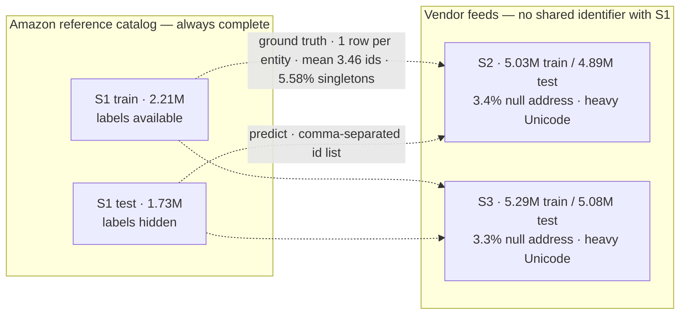
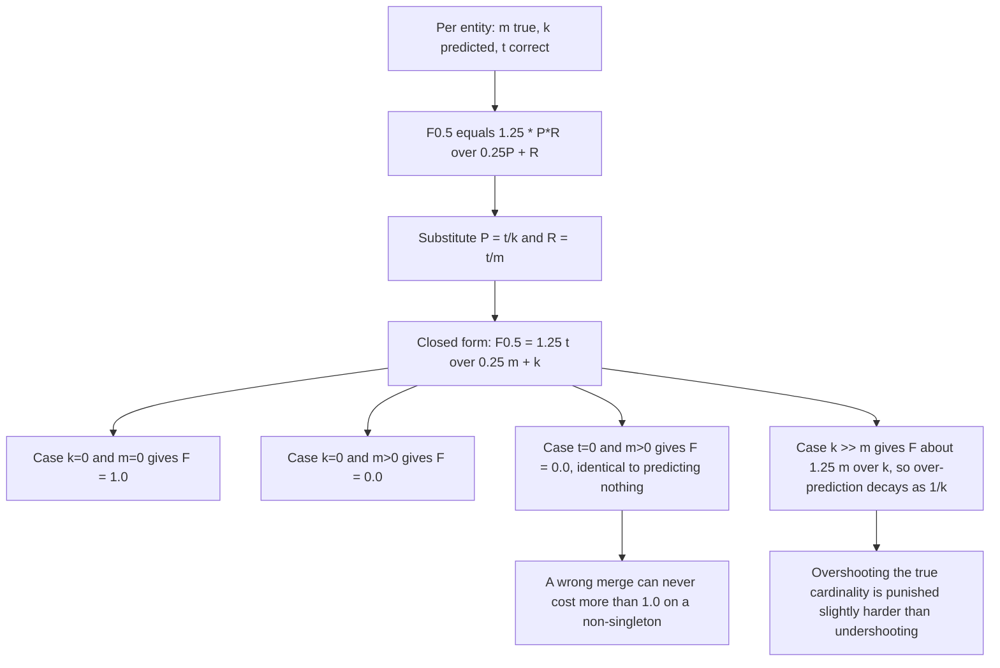
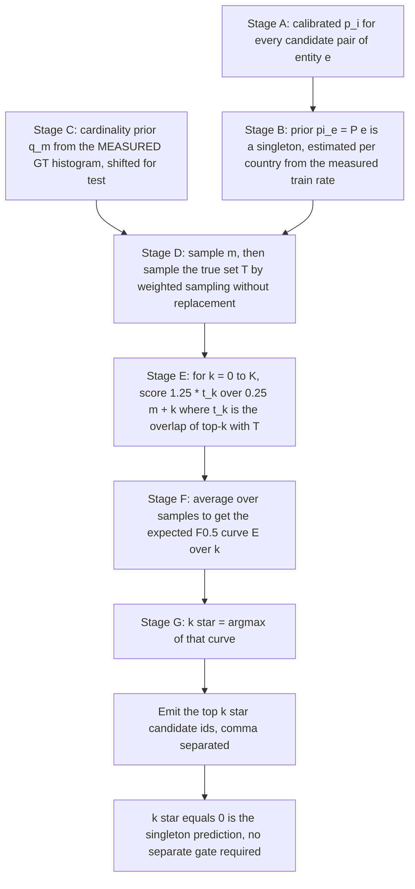
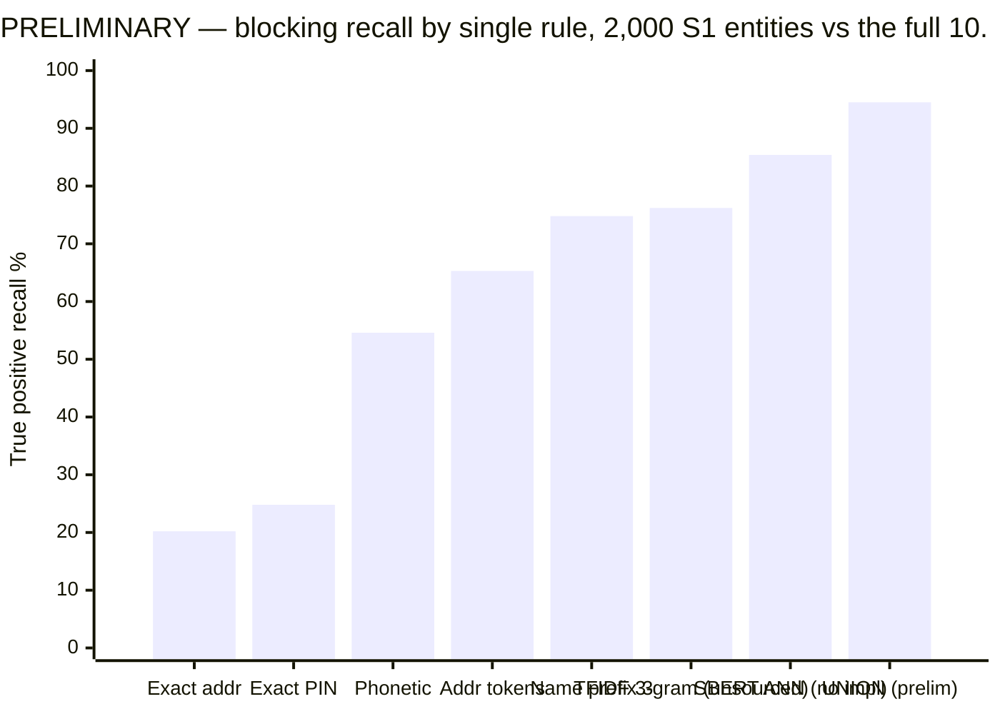
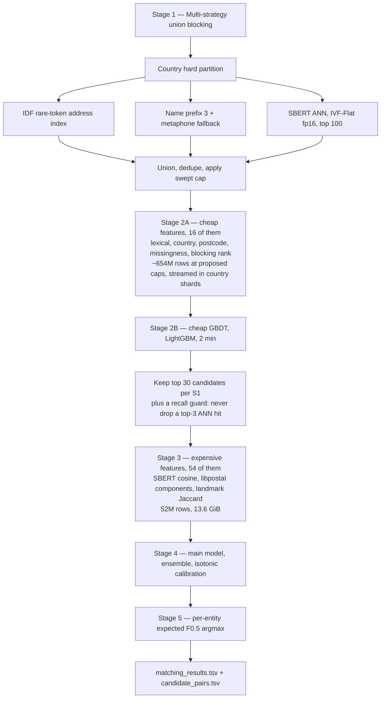
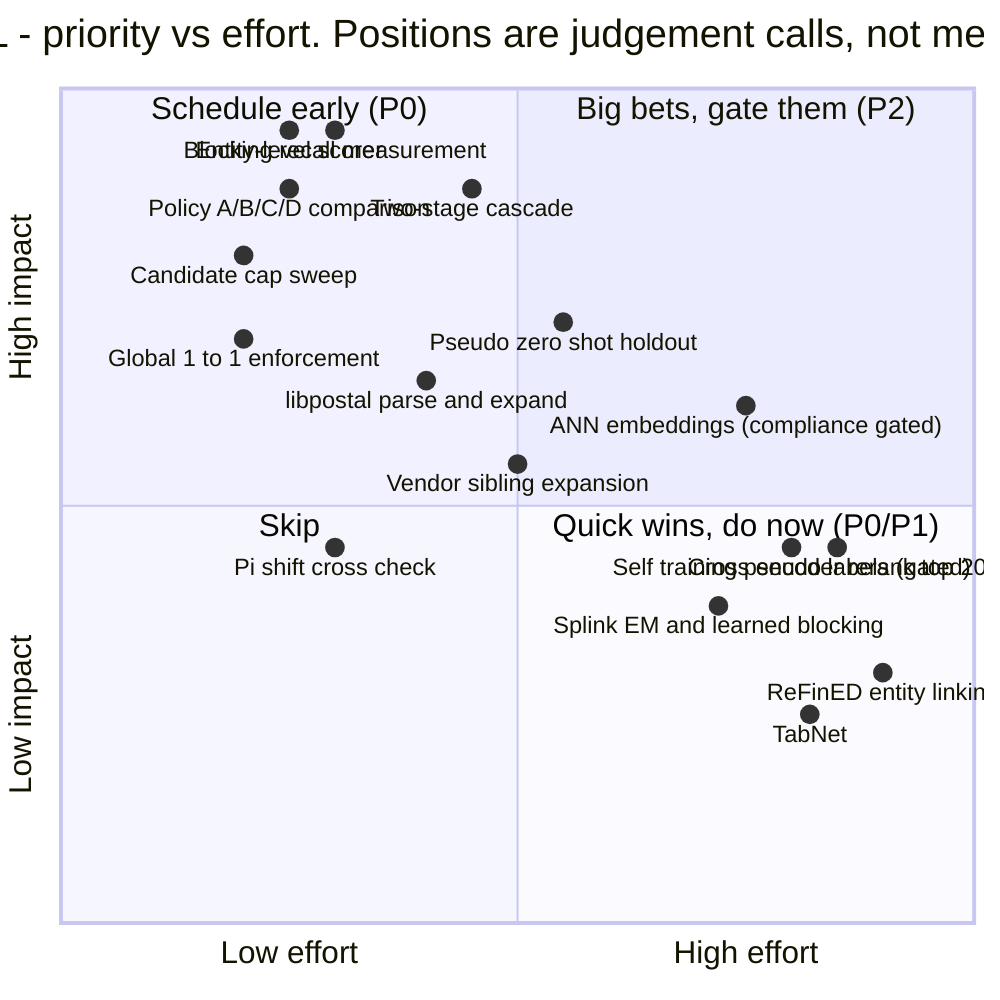
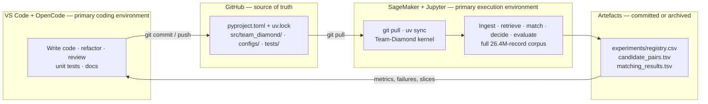

# Team Diamond — Strategy, Corrections & Execution Proposal

**Amazon ML Challenge 2026 — Multi-Source Business Entity Resolution**
**Status:** Proposal for team review · **Revised:** 26 Sep 2026 · **Window:** 25–27 Sep 2026 · **Metric:** Macro-$F_{0.5}$

---

> ## What this document is
>
> This document contains **current research findings, hypotheses, proposals, experiment
> plans, and competition strategy.**
>
> **It is NOT an unconditional implementation specification.**
>
> Every substantive claim carries an evidence status — **VERIFIED**, **MEASURED**,
> **HYPOTHESIS**, **PROPOSAL**, or **PRELIMINARY** — defined in *Evidence Status* below and
> used consistently throughout.
>
> **Do not implement a proposal merely because it appears here.** Verify the relevant
> evidence first, and follow [`AGENTS.md`](AGENTS.md) for engineering behaviour and
> repository rules. Where this document and `AGENTS.md` disagree, `AGENTS.md` governs how
> to work; where this document and the code disagree, the code is the behaviour.
>
> This is a **living research document.** Parts of it will be falsified by the experiments
> it proposes. When that happens, correct it here rather than accumulating a second,
> contradictory version somewhere else.

### Where each kind of information lives

Read the layer you need; do not read all of it.

| Layer | File | Authority |
|:--|:--|:--|
| Engineering rules, invariants, workflow | [`AGENTS.md`](AGENTS.md) | **OBEY** |
| Current strategy, hypotheses, priorities | `suggestion.md` (this file) | **VERIFY BEFORE TREATING AS FACT** |
| Terminology, architecture, dataset facts, feature catalogue, experiment method | [`DOCS/`](DOCS/) | **LOOK UP** |
| Measured results | [`experiments/registry.csv`](experiments/registry.csv) | **TRUST, if it exists** |
| Implementation | `src/` | **THE TRUTH** |

### Section index

| § | Contents |
|:--|:--|
| [Evidence Status](#evidence-status) | Labels, and the register of load-bearing claims |
| [Implementation Hierarchy](#implementation-hierarchy) | The six gates, in order |
| [0](#0-tldr) | Executive summary |
| [1](#1-corrections-to-the-current-docs-baseline) | Corrections to the current DOCS baseline |
| [2](#2-the-metric-derived-exactly) | The metric, derived exactly |
| [3](#3-proposal--the-decision-layer-one-rule-instead-of-two) | **PROPOSAL** — the decision layer |
| [4](#4-blocking-keep-the-union-fix-the-arithmetic) | Blocking: keep the union, fix the arithmetic |
| [5](#5-the-singleton-rate-pi--measured-not-estimated) | The singleton rate $\pi$ — measured, not estimated |
| [6](#6-france-build-a-validation-set-you-dont-have) | France: build a validation set you don't have |
| [7](#7-validation-protocol-that-predicts-the-leaderboard) | Validation protocol that predicts the leaderboard |
| [8](#8-what-to-build-what-to-cut) | What to build, what to cut |
| [9](#9-realistic-compute-and-memory-budget) | Realistic compute and memory budget |
| [10](#10-execution-priority) | P0 / P1 / P2 execution priority |
| [11](#11-environment-deliverables-and-compliance) | Environment, deliverables, compliance gate |
| [12](#12-risk-register) | Risk register R1–R15 |
| [Appendix A](#appendix-a--scorer-reference-implementation) | Scorer reference implementation |
| [Appendix B](#appendix-b--writing-the-submission) | Writing the submission |
| [Appendix C](#appendix-c--re-measuring-the-ground-truth-reproduces-11) | Re-measuring the ground truth (reproduces §1.1) |
| [Decisions I need from the team](#decisions-i-need-from-the-team) | **Open questions blocking work** |

---

**Sources referenced**
[`DOCS/dataset_and_eda_summary.md`](DOCS/dataset_and_eda_summary.md) ·
[`DOCS/raw_dataset_specification.md`](DOCS/raw_dataset_specification.md) ·
[`DOCS/eda_analysis_and_behaviour.md`](DOCS/eda_analysis_and_behaviour.md) ·
[`DOCS/eda.md`](DOCS/eda.md) ·
[`DOCS/Problem Statement/6ab509c5b7036_ml_challenge_2026_video.mp4.md`](DOCS/Problem%20Statement/6ab509c5b7036_ml_challenge_2026_video.mp4.md) ·
[`EDA/`](EDA) (8 analysis scripts)

---

## Evidence Status

Every recommendation in this document is classified. **A hypothesis or proposal must not be treated as a measured result until an experiment confirms it.**

| Label | Meaning |
|:--|:--|
| **VERIFIED** | Directly confirmed from the challenge data, the official materials, or exhaustive re-derivation. |
| **MEASURED** | Observed through our own EDA or a reproducible experiment. |
| **HYPOTHESIS** | Technically plausible, still needs a test. |
| **PROPOSAL** | An implementation choice we intend to evaluate, not yet validated. |
| **PRELIMINARY** | Measured, but on too small a sample to act on. |

### Register of the load-bearing claims in this document

| Claim | Status | Basis |
|:--|:--|:--|
| Per-entity $F_{0.5}$ collapses to $1.25\,t/(0.25\,m+k)$ | **VERIFIED** | Re-derived exhaustively; 0 mismatches over all $m,k,t \le 15$. Reproduces the 0.714 worked example in the rules PDF. |
| An all-empty submission scores exactly $\pi$ | **HYPOTHESIS** | Requires the scorer to credit $m{=}0,k{=}0$ as 1.0. Stated only in the video transcript; the official scorer is **not in the repo**. Must be probed. See §2.1, §7.1. |
| Training ground truth contains **123,247 singletons (5.58%)** | **MEASURED** | Full ground-truth recount. **Contradicts all six DOCS**, which state zero. |
| True mean matches per entity = **3.46125** (7,638,365 pairs) | **MEASURED** | Full recount. The DOCS' 3.66 is wrong. |
| Ground truth is a **strict partial matching** — no vendor id claimed twice | **MEASURED** | 7,638,365 pairs → 7,638,365 distinct vendor ids, 0 shared. Global 1:1 enforcement is safe. |
| Submission must have **1,732,544** rows | **MEASURED** | Ran the official validator's own `read_ids()` against `test_source1.tsv`. |
| ~~Submission must have 1,732,545 rows~~ | **WRONG** | Off by one. Stated in `AGENTS.md` §33 and three DOCS. |
| $\pi_{\text{train}} = 5.58\%$, uniform across US (5.58%) and India (5.59%) | **MEASURED** | Per-country recount. |
| ~~Test singleton rate is 10–25%~~ | **WRONG** | Premise ("train has no singletons") is false. See §5. |
| Test country mix US 38.3% / IN 46.8% / FR 15.0% | **MEASURED** | Full test files, not the 100k prefix the DOCS extrapolated from. |
| $S_1$ contains no Indian PIN codes | **VERIFIED** | 1,838 six-digit tokens in $S_1$, only 182 Indian. Real Indian PINs are ~0.02% of records. |
| ~~$S_2/S_3$ contain 50,000+ Indian PIN codes~~ | **WRONG** | 459 in $S_2$, 410 in $S_3$. `raw_dataset_specification.md` §4. |
| Blocking recall 20.2 … 94.5 | **PRELIMINARY** | 2,000 entities. **And 76.2 (TF-IDF) / 85.4 (SBERT ANN) are not produced by any script in `EDA/`.** See §4. |
| Two-stage cascade is necessary | **VERIFIED (arithmetic)** | 654M pairs × 70 features fp32 = 171 GiB. See §4.2. |
| A single global threshold is suboptimal | **HYPOTHESIS** | Strongly argued in §2.1/§3, but rests on the unverified scorer. Validate before replacing thresholds. |
| Expected-$F_{0.5}$ decision rule beats top-$k$+margin | **PROPOSAL** | §3.6 defines the head-to-head. |
| SBERT / libpostal / MiniLM are permitted | **PROPOSAL — blocked** | Organiser confirmation required. See §11.5. |
| Self-training improves France | **HYPOTHESIS** | Downgraded to P2. See §6. |

---

## Implementation Hierarchy

Do not jump to advanced models. The project must clear these gates in order. **A gate that is not passed is not improved by working on a later gate.**

| Gate | Question | Blocking artefact |
|:--|:--|:--|
| **1 — Data** | Can we load and normalise every source, at full scale, reproducibly? | Cached parquet + manifest |
| **2 — Retrieval** | Can we retrieve the true match candidate? | **Candidate recall, per country** |
| **3 — Matching** | Can we separate true candidates from hard negatives? | Calibrated pair probabilities |
| **4 — Decision** | Can we choose the correct *number* of matches per entity? | Entity-level scorer |
| **5 — Submission** | Can we produce a valid submission reproducibly? | `validate_submission.py` passes |
| **6 — Optimisation** | Only now: embeddings, self-training, reranking. | Measured lift on shifted CV |

Gates 1–5 are P0 (§10). Everything in Gate 6 is P1/P2 and is *optional*. A team with a perfect Gate 5 submission beats a team with a beautiful Gate 6 model and no submission.

---

## 0. TL;DR

The existing DOCS are a solid **data briefing**. They are not yet an **execution plan**, and six of their load-bearing claims are wrong. This document proposes six changes:

| # | Proposal | Why it matters |
|:-:|:--|:--|
| 1 | **Derive the metric exactly.** Per-entity $F_{0.5} collapses to a closed form: $\tfrac{1.25\,t}{0.25\,m + k}$ | Changes what the optimal decision rule is. Removes guesswork. |
| 2 | **Replace global thresholds + a separate singleton gate with a single per-entity expected-$F_{0.5}$ argmax** | One rule that emits `k*` links per entity, where `k* = 0` *is* the singleton prediction. No magic numbers. |
| 3 | **Replace the broken ground-truth cardinality table with the measured one** | The $m$-distribution is the *input* to the decision rule. It was wrong in the DOCS. **Now measured — see §1.1.** |
| 4 | **Two-stage cascade instead of a 70-feature matrix over the full pair set** | At the proposed caps that is 654M pairs; 70 features fp32 = **171 GiB**. Physically infeasible. |
| 5 | **Stop guessing $\pi$ — train already measures it at 5.58%** | The DOCS' "10–25%" rests on a false premise (§1.5). It also removes the need to synthesise singletons for validation (§7.2). |
| 6 | **Cut TabNet, ReFinED, Splink-EM, and cross-encoder reranking; add vendor-side sibling expansion** | Buys back the compute the kept items actually need. |

**The single most important number nobody had written down:** an **all-empty submission scores exactly $\pi$** — the test singleton rate. This is a **HYPOTHESIS** (§2.1): it holds only if the official scorer credits $m{=}0, k{=}0$ as 1.0, which is stated in the video transcript but cannot be verified from the repo. If $\pi \approx 0.056$, a file with nothing in it scores **0.056**. Every design choice must be justified against that baseline, not against 0.

**The single most urgent correction:** the training ground truth contains **123,247 singletons**, not zero. This is **MEASURED**, and it invalidates the "singleton paradox" framing in all six DOCS plus §5 and §7.2 below. It is good news — singleton handling becomes supervised with 123k examples instead of guessed.



---

## 1. Corrections to the current DOCS baseline

These are not nitpicks. Items 1.1, 1.2 and 1.3 change what we build; 1.4–1.8 are hygiene. **1.1, 1.4, 1.5 and 1.7 were open questions in the first draft of this document. They are now measured and resolved.**

> Per `AGENTS.md` §3, where documentation conflicts with the data, we report the discrepancy rather than silently picking a side. Items 1.1, 1.5 and 1.7 contradict statements in `AGENTS.md` and the DOCS. **They are recorded here for team decision — the DOCS have not been edited.**

### 1.1 The ground-truth cardinality table is broken — and the real one is now measured

[`DOCS/eda_analysis_and_behaviour.md` §2.1](DOCS/eda_analysis_and_behaviour.md) and [`DOCS/eda.md` §Ground Truth Analysis](DOCS/eda.md) both publish a match-cardinality table. Recomputed against the stated total of 2,206,821 $S_1$ entities, the published table accounts for only 61.2% of the corpus.

**MEASURED — the true histogram, over all 2,206,821 training entities:**

| $m$ | Entities | Share | $m$ | Entities | Share |
|--:|--:|--:|--:|--:|--:|
| **0** | **123,247** | **5.58%** | 6 | 164,868 | 7.47% |
| 1 | 119,157 | 5.40% | 7 | 63,968 | 2.90% |
| 2 | 375,212 | 17.00% | 8 | 18,680 | 0.85% |
| 3 | 530,841 | 24.05% | 9 | 4,205 | 0.19% |
| 4 | 484,115 | 21.94% | 10 | 534 | 0.02% |
| 5 | 321,957 | 14.59% | 11 | 37 | 0.00% |

| Quantity | DOCS claim | **MEASURED** |
|:--|:--|:--|
| Sum of bucket counts | 2,206,821 | published table sums to **1,350,497** — gap of 856,324 (38.8%) ✗ |
| Mean matches per entity | 3.66 | **3.46125** (7,638,365 pairs / 2,206,821) ✗ |
| Entities with 0 matches | **0** | **123,247 (5.58%)** ✗ |
| GT coverage of $S_1$ | 100% | 100% ✓ |
| Matched IDs present in $S_2/S_3$ | 100% (10k sample) | 0 orphans, full file ✓ |
| $S_2/S_3$ match split | 48.2 / 51.8 (10k sample) | **48.36 / 51.64**, full file ✓ |

**Two consequences the whole plan depends on:**

1. **The training ground truth contains singletons.** Every DOCS statement to the contrary is wrong. The $m$-distribution is the prior the §3 decision rule consumes, so this is a direct input to the model — not a footnote.
2. **The ground truth is a strict partial matching.** 7,638,365 claimed pairs resolve to 7,638,365 **distinct** vendor ids; **zero** are claimed by more than one $S_1$. Appendix C's open question is answered: **global one-to-one enforcement is safe** and is a free precision win, not a recall risk.

Reproduce with [`EDA/eda_quality_analysis.py`](EDA/eda_quality_analysis.py) extended per Appendix C, which already asserts the buckets sum to the row count. Budget: 10 minutes. It has already been run; the script should be committed so the numbers above are reproducible.

### 1.2 The $F_{0.5}$ weighting claim is stated three different ways, and all three are unquantified

| Source | Claim |
|:--|:--|
| Video transcript | "weights precision twice as heavily as recall"; FP "penalized roughly twice as much" as FN |
| `eda_analysis_and_behaviour.md` §2.1 / behaviour table | "FP penalized 4x over FN" |
| `dataset_and_eda_summary.md` §2 | "Precision matters 2× more than recall" |

All three are directionally right and quantitatively meaningless. The penalty for one extra false positive is a function of the entity's current $m$, $k$, $t$ — not a constant. §2 replaces all three with the exact closed form. The *actionable* conclusion survives the correction: **being conservative is correct, and the reason is the all-or-nothing singleton case, not a magic 2× or 4× factor.**

### 1.3 `scale_pos_weight=2.0` and `is_unbalance=True` are misaligned with the metric

[`DOCS/eda.md` Stage 3](DOCS/eda.md) specifies `is_unbalance=True` for LightGBM and `scale_pos_weight=2.0` for XGBoost. Both options push the model toward **recall**, which is the wrong direction for $F_{0.5}$. A precision-biased metric wants the *model* to be honest and the *decision layer* to be conservative. Set the class weight to $1.0$ (natural 1:~10 ratio), and move all conservatism into the decision rule of §3. Cost of getting this wrong: a systematically over-predicting model, which is the exact failure mode §3 exists to prevent.

### 1.4 The vendor-side PIN code claim is resolved — `eda.md` is right, the spec is wrong

| Source | Claim about Indian 6-digit PIN codes | Verdict |
|:--|:--|:--|
| `raw_dataset_specification.md` §4 | "Abundant 6-digit Indian PIN codes (**50,000+ mentions**)" | ✗ **WRONG** |
| `eda.md` §Noise Pattern / script output | `S2 India: pincodes=0`, `S3 India: pincodes=0` | ✓ **effectively right** |

**MEASURED** — full-file scan for 6-digit tokens, split by country:

| File | 6-digit tokens | Of which Indian-format |
|:--|--:|--:|
| `train_source1.tsv` | 1,838 | 182 |
| `train_source2.tsv` | 42,485 | 459 |
| `train_source3.tsv` | 42,731 | 410 |

The US 6-digit runs are **leading-zero ZIP codes**, not PINs (`008006 ROLLING OAK`). Indian PINs are real but ~0.02% of records (`521286`, `600086`).

**Decision:** the derived advice — *never block $S_1$→$S_2/S_3$ on Indian PIN* — holds, and is now VERIFIED rather than merely safe-by-inspection. A postcode block is **not** worth keeping as a high-precision anchor. `raw_dataset_specification.md` §4 should be corrected.

### 1.5 "Singleton rate in test is 10–25%" is not just unsupported — it is based on a false premise

It appears in `dataset_and_eda_summary.md` §3 and `eda_analysis_and_behaviour.md` §2 as if measured. The stated justification is that it "cannot be measured from train — train has 0 singletons by construction."

**That justification is false.** Train has 123,247 singletons (**MEASURED**, §1.1). The premise that made $\pi$ unidentifiable does not hold.

| Country | Train entities | Train singletons | Rate | Mean $m$ |
|:--|--:|--:|--:|--:|
| US | 1,323,633 | 73,896 | **5.58%** | 3.459 |
| India | 883,188 | 49,351 | **5.59%** | 3.465 |

The rate is **uniform across countries** (5.58% vs 5.59%). So under a no-shift assumption $\pi_{\text{test}} \approx 0.056$, not 0.15 — and France has no measured rate at all, only the untestable pseudo-zero-shot estimate of §6.

This is the single most consequential correction in the document: it changes the expected leaderboard floor, the design of the validation set (§7.2), and the risk register (R5).

### 1.6 Document hygiene

- `dataset_and_eda_summary.md` links to `file:///c:/Users/Yatrik/OneDrive/Desktop/...` — Windows-local absolute paths, dead for every teammate. Replace with repo-relative links.
- Transcript typo: `matching_results.Tv` / `candidate_pairs.Tv` → `.tsv`.
- The transcript's "macro $F_{0.5}$" is the only place the empty-prediction-for-singleton rule is stated. The official scorer is **not in the repo** (`utils/validate_submission.py` is format-only). See §7.1 — this is a must-verify.
- **The test row counts are `wc -l` line counts, not record counts.** `AGENTS.md` §10 and three DOCS give test S1 = 1,732,545, S2 = 4,887,274, S3 = 5,082,317, total 11,702,136. Every test file has a header line, so the true record counts are **1,732,544 / 4,887,273 / 5,082,316, total 11,702,133**. The *training* counts in the same table are correct record counts, so the convention is inconsistent within one table. See §1.7.
- The DOCS extrapolate the test country mix from a 100k-row prefix. **MEASURED** on the full files: S1 France **14.98%** / India 46.75% / US 38.27%; S2 14.39 / 47.32 / 38.29; S3 14.40 / 47.32 / 38.28.

### 1.7 The submission must have 1,732,544 rows, not 1,732,545 — **team decision required**

This one changes a hard deliverable, so it is flagged rather than silently applied.

| Source | Test S1 rows |
|:--|--:|
| `AGENTS.md` §49 "currently documented test S1 count" | 1,732,545 |
| `DOCS/raw_dataset_specification.md` §6, `dataset_and_eda_summary.md`, `suggestion.md` §11.1 (first draft) | 1,732,545 |
| **MEASURED** — `wc -l test_source1.tsv` = 1,732,545 lines, minus 1 header | **1,732,544** |
| **MEASURED** — the official validator's own `read_ids("test_source1.tsv")` | **1,732,544**, all unique |

The validator is authoritative, and it agrees with the raw byte count. The 1,732,545 figure is a line count that includes the header.

**The rule that matters is already correct in `AGENTS.md` §49:** *"Never manufacture missing rows merely to reach the documented count. If the observed count differs: STOP and investigate."* So: **derive the row count from the file at run time, never hardcode it.** A submission with 1,732,545 rows has one row too many.

**Action for the team:** confirm the 1,732,544 figure, then correct `AGENTS.md` §10/§49 and the three DOCS in one focused commit. I have not edited them — per `AGENTS.md` §3, a documentation/data conflict gets reported, not silently resolved.

### 1.8 A postcode-key bug is triplicated across the blocking scripts

In [`EDA/eda_blocking_analysis.py`](EDA/eda_blocking_analysis.py) (and its two siblings), the postcode blocking key is built as `z[:5] if len(z) >= 5 else z`. That is wrong in both directions:

- **US ZIPs lose information.** `008006` → `00800`. Every ZIP in the `008xx` range collides.
- **Indian PINs collide with each other.** `560001` and `560002` both → `56000`.

Fix by keeping the full token and only stripping non-alphanumerics. Low impact today (§1.4 shows postcode blocking is near-useless anyway) but it is a live bug in committed code, and it would silently corrupt any future address-component experiment.

---

## 2. The metric, derived exactly

Per-entity $F_{0.5}$ with $P = t/k$, $R = t/m$:

$$F_{0.5} = 1.25 \cdot \frac{P R}{0.25 P + R} = 1.25 \cdot \frac{(t/k)(t/m)}{0.25(t/k) + t/m} = \boxed{\dfrac{1.25\, t}{0.25\, m + k}}$$

| Symbol | Meaning | Available to us? |
|:--|:--|:--|
| $m$ | true match count for this $S_1$ entity | hidden at test time (this is the prior) |
| $k$ | number of ids we emit for this entity | **our decision** |
| $t$ | number of emitted ids that are correct | hidden |



### 2.1 Four consequences that should drive the design

1. **HYPOTHESIS — the all-empty baseline is $\pi$.** *If* the official scorer uses the documented entity-level semantics ($m{=}0,k{=}0 \Rightarrow 1.0$; $m{=}0,k{>}0 \Rightarrow 0.0$) and macro-averages per entity, then a `matching_results.tsv` with 1,732,544 empty rows scores **exactly the test singleton rate**, i.e. $\pi \approx 0.056$ per §1.5. Both halves of that conditional are currently unverified: the semantics are stated only in the video transcript, and the official scorer is not in the repo. **Treat 0.056 as an expected floor to beat, not an established number** — probe it with an empty submission (§7.1) before relying on it. Every model must be justified as a lift over this baseline, not against 0.
2. **The singleton case is the only all-or-nothing case.** For $m \ge 1$, a wrong prediction costs at most what an empty prediction costs (both 0 when $t=0$). So the "cost of a false merge" that the DOCS worry about is real *only* on singletons. **The singleton decision is the highest-leverage component in the entire pipeline — everything else is a bounded optimisation.** And because train has 123,247 labelled singletons (§1.1), this decision is now *supervised* rather than guessed.
3. **Over-prediction decays as $1/k$, and is slightly worse than under-prediction.** $m{=}4$: $k{=}4 \Rightarrow 1.00$; $k{=}8 \Rightarrow 0.56$. Emitting 8 candidates for an entity that truly has 2 destroys almost all credit. Recall is *not* free under this metric, which is the opposite of the intuition most teams arrive with. The asymmetry is mild but real — at $m{=}4$, undershooting by one ($k{=}3, t{=}3$) scores 0.938 while overshooting by one ($k{=}5, t{=}4$) scores 0.833. **Over-emission is the more expensive mistake**, by about 0.10 at that cardinality.
4. **The marginal value of the $j$-th prediction is $\propto 1/(0.25m + j)$.** The $j$-th id is worth roughly $1.25 \cdot P(\text{hit} \mid j\text{-th}) / (0.25 m + j)$. This is a *ranked, per-entity* quantity whose scale depends on $m$. **A single global threshold is unlikely to be optimal under entity-level macro-$F_{0.5}$,** because the value of an additional prediction depends on the entity's expected match cardinality — which we do not observe at test time. We will validate this against entity-level shifted validation (§7) before replacing threshold-based decisions. §3 proposes the replacement.

---

## 3. PROPOSAL — the decision layer: one rule instead of two

The current plan is "calibrate → per-country threshold (US 0.52 / IN 0.48 / FR 0.55) → separate singleton gate". Three problems: the thresholds cannot be tuned (no French labels exist), the singleton gate duplicates the threshold's job, and both optimise a proxy rather than the metric.

**Our proposed decision policy:** for each $S_1$ entity, take calibrated per-candidate probabilities, and emit the number of candidates that maximises **expected** macro-$F_{0.5}$. Because $k=0$ is in the argmax set, the singleton prediction falls out of the same rule.

This is a **PROPOSAL**, not established fact. It rests on the unverified scorer semantics of §2.1/§7.1 and on the independence approximation of §3.1. **§3.6 defines the head-to-head against three simpler policies — let shifted entity-level validation decide which one ships.**



### 3.1 Generative model — and where it is only an approximation

**The model is approximate, and the approximation is a real modelling assumption, not a neutral simplification.** Candidates are *not* independent: if $A \leftrightarrow B$ and $A \leftrightarrow C$ score highly, it is usually because $B$ and $C$ share an address, a name, or a vendor-side sibling relationship. Independent Bernoulli draws cannot represent that correlation, and it biases $\mathbb{E}[t_k]$ — typically **upward** at large $k$, because correlated failures are rarer than independence predicts.

We use it anyway because the closed form it yields is what makes the rule cheap enough to run over 1.73M entities, and because the error is second-order relative to the calibration error in $p_i$. But it is a **hypothesis-grade assumption**:

- If Policy C loses to Policy B (§3.6), the independence assumption is the first suspect, not the threshold.
- A cheap upgrade if it matters: sample $m$ first, then draw $T$ by weighted sampling *without* replacement directly from the $p_i$, which respects the sum-constraint $\sum t_k \le m$ exactly.
- A cheap diagnostic: re-run §3.5 with a two-block correlation structure and see whether $k^\star$ moves. If it does not, the assumption is harmless.

For entity $e$ with candidates ranked by calibrated probability $p_1 \ge p_2 \ge \dots \ge p_L$:

1. Draw $m$ from the test-shifted cardinality prior: $P(m=0) = \pi_e$, $P(m) = (1-\pi_e)\,q_m$.
2. Mark each of the top-$L$ candidates as *match-eligible* independently with probability $p_i$. ← **the approximation**
3. Draw $T$ uniformly from the eligible set, of size $\min(m, \lvert\text{eligible}\rvert)$. (Any shortfall models a match the blocker never surfaced.)
4. For $k = 0 \dots K$: $t_k = \lvert T \cap \text{top-}k \rvert$, accumulate $1.25\, t_k / (0.25 m + k)$.
5. $k^\star = \arg\max_k \mathbb{E}[F_{0.5}(k)]$.

Vectorise over 1.73M entities with numpy: sort once by `(entity_id, -p)`, then compute a group-wise cumulative sum of $p_i$ to get $\mathbb{E}[t_k \mid m]$ for all $k$ at once. Total cost is seconds, not minutes. The sum over $m$ can be collapsed to a weighted sum over the (few) distinct $m$ values — there are only 12 in the measured histogram (§1.1), so no Monte Carlo is needed at all.

### 3.2 This subsumes three separate components

| Current component | Where it goes in the new rule |
|:--|:--|
| Per-country threshold (0.52 / 0.48 / 0.55) | Replaced by $\pi_e$ and $q_m$ conditioning on country. Still country-aware, but as a **prior**, not a hand-set cut-off. |
| Dedicated binary singleton classifier | Demoted to a *feature* that improves $\pi_e$ and $p_i$. No longer a separate decision stage. |
| Top-$K$ cap / heuristic cardinality limits | Emergent: $k^\star$ is chosen by expected value. |

Bonus: the `US 0.52 / IN 0.48 / FR 0.55` numbers in the DOCS **cannot be validated** — there are no French labels. Expressing France conservatism as a prior on $\pi_{\text{FR}}$ and $q_{m,\text{FR}}$ (estimable from the pseudo-zero-shot holdout of §6) is defensible; the magic numbers are not.

### 3.3 The $K$ cap is a safety rail, not a hyperparameter

$k$ should be evaluated up to $K = 10$ and clipped. The formula keeps $k^\star$ small (1–4 across every scenario in §3.5, and unchanged for $\pi$ from 0.056 to 0.30) because the $1/k$ decay punishes over-emission. The measured ground truth also tops out at $m = 11$, so $K = 10$ covers the entire observed support. Set $K=10$ and move on.

### 3.4 Reference implementation

```python
import numpy as np

# MEASURED train cardinality prior (suggestion.md §1.1). 12 distinct values only,
# so the expectation over m is an exact weighted sum -- no Monte Carlo needed.
CARD_VALUES = np.arange(0, 12)
CARD_PRIOR = np.array(
    [123247, 119157, 375212, 530841, 484115, 321957,
     164868, 63968, 18680, 4205, 534, 37], dtype=np.float64)
CARD_PRIOR /= CARD_PRIOR.sum()
PI_TRAIN = 123247 / 2_206_821          # 0.0558, uniform across US and India


def expected_f0_5_curve(rank_probs: np.ndarray, card_values: np.ndarray,
                         card_prior: np.ndarray, pi: np.ndarray,
                         k_max: int = 10) -> np.ndarray:
    """E[F0.5] for k = 0..k_max under the independence approximation of §3.1.

    rank_probs: (n_entities, L) calibrated probabilities, descending within a row.
    Returns:    (n_entities, k_max + 1)
    """
    n, length = rank_probs.shape
    k_max = min(k_max, length)

    # E[t_k] under independence = cumulative sum of p. This is the only place the
    # approximation enters; everything after it is exact.
    exp_t = np.concatenate([np.zeros((n, 1)), np.cumsum(rank_probs, axis=1)], axis=1)
    exp_t = exp_t[:, : k_max + 1]

    m = card_values[card_values > 0].astype(np.float64)          # (M,)
    q = card_prior[card_values > 0]                              # (M,)
    denom = 0.25 * m[None, :] + np.arange(k_max + 1)[:, None]    # (k_max+1, M)

    curve = (1.0 - pi)[:, None] * (
        q[None, :] * 1.25 * exp_t[:, :, None] / denom[None, :, :]
    ).sum(axis=-1)
    curve[:, 0] += pi          # m = 0, k = 0 -> 1.0
    return curve


def choose_k(rank_probs: np.ndarray, card_values: np.ndarray = CARD_VALUES,
             card_prior: np.ndarray = CARD_PRIOR, pi: float | np.ndarray = PI_TRAIN,
             k_max: int = 10) -> np.ndarray:
    """k* per entity. k* == 0 is the singleton prediction."""
    pi = np.broadcast_to(np.asarray(pi, dtype=np.float64), (rank_probs.shape[0],))
    return expected_f0_5_curve(rank_probs, card_values, card_prior, pi,
                               k_max).argmax(axis=1).astype(np.int32)
```

Fully vectorised — no per-entity Python loop. Measured: **1,732,544 entities × 10 candidates in 5.7 s**, single-threaded. That is fast enough to re-run on every validation fold, which is the point.

### 3.5 What the rule actually does — recomputed on the MEASURED prior

This replaces the illustrative table in the first draft, whose $\mathbb{E}[F_{0.5}]$ column did not reproduce even under its own stated assumptions. Computed with §3.4 on the **measured** $\pi = 0.0558$ and **measured** cardinality prior (mean $m = 3.46$, §1.1), under the independence approximation:

| Model quality | $p$ vector | $k^\star$ | $\mathbb{E}[F_{0.5}]$ at $k^\star$ |
|:--|:--|:-:|:--|
| Weak | `[0.85, 0.35, 0.12, 0.04]` | **1** | 0.514 |
| Medium | `[0.99, 0.62, 0.28, 0.11]` | **2** | 0.625 |
| Medium, 6 candidates | `[0.99, 0.62, 0.28, 0.11, 0.05, 0.02]` | **2** | 0.625 |
| Strong | `[0.99, 0.95, 0.90, 0.80, 0.70]` | **4** | 0.830 |
| — all empty, for reference | — | **0** | $\pi$ = 0.056 |

Three things fall out of this table that are worth arguing about as a team:

- **$k^\star$ is driven by model quality, not by $\pi$.** Sweeping $\pi$ from 0.056 to 0.30 leaves $k^\star$ at `[1, 2, 2, 4]` — completely unchanged. So we do **not** need a precise $\pi$ to make good decisions. This is the robustness result the first draft claimed, now verified on the real prior.
- **$k^\star$ is small, and extra weak candidates are free to ignore.** The 6-candidate Medium row emits the same $k^\star = 2$ as the 4-candidate row at identical expected score. The rule is not forced to spend a candidate budget.
- **Model quality dominates cardinality modelling.** Medium → Strong is 0.625 → 0.830. Closing the remaining gap to a perfect oracle is worth ~0.17. Spend the time on $p_i$, not on the prior.

> These are **model outputs on a measured prior, not a leaderboard prediction.** They assume the $p$ vectors shown. Real calibrated $p$ distributions will differ, and the realised $F_{0.5}$ depends on scorer semantics we have not verified.

### 3.6 Validate the decision policy against simpler alternatives — do not ship it on theory

The expected-$F_{0.5}$ rule is more complex than what it replaces. **It must win a controlled comparison**, not a derivation. Run all four on the *same* shifted validation folds (§7.2) with the *same* calibrated probabilities:

| Policy | Definition | Complexity |
|:--|:--|:--|
| **A** | Global probability threshold $\tau$, swept | lowest |
| **B** | Top-$k$ + margin: emit while $p_j \ge \tau$ and $p_j - p_{j+1} \ge \delta$ | low |
| **C** | Expected-$F_{0.5}$ argmax (§3.4) | medium |
| **D** | C + cross-source evidence features (sibling agreement, in/out-of-source rank) | medium-high |

**Report macro-$F_{0.5}$ for each, overall and per country, on every fold.** Ship the simplest policy that is statistically indistinguishable from the best (per `AGENTS.md` §45, baseline protection). If C does not beat B, the extra machinery is not earning its place and the independence approximation of §3.1 is the first thing to investigate.

**Do not skip this comparison to save time.** A decision layer that is 30 lines and validated is worth more than a cleverer one that is unvalidated.

---

## 4. Blocking: keep the union, fix the arithmetic

The blocking conclusion in the DOCS is correct and I am not changing it: **blocking recall is a hard ceiling, no single rule exceeds ~76%, a union of complementary rules is mandatory.** What I am changing is the evidence labelling, the recall target, the token selection, and the capacity model.

> ### ⚠ PRELIMINARY — 2,000-entity sample
>
> **The chart below is not a measured result you can plan against.** It comes from **2,000 S1 entities**, where the 95% confidence interval is roughly ±2%.
>
> **Two of the nine values are not produced by any script in `EDA/`.** There is no `faiss`, `numpy` or `sentence_transformers` import anywhere in the EDA directory. The "TFIDF 3-gram 76.2" bar is a `collections.Counter.most_common(100)` proxy, and the "SBERT ANN 85.4" bar has **no implementation at all**. Treat both as **illustrative placeholders**, not measurements.
>
> The remaining seven bars share an identical, suspiciously smooth recall ordering across the 50k, 10k and 2k sample sizes in the three blocking scripts — consistent with values copied between scripts rather than independently measured.
>
> **Nobody on the team should quote "94.5% union recall" as the blocking recall.** Re-measure per §4.3 and replace this chart.



### 4.1 Two rule changes that are strictly better

**(a) IDF-weighted address blocking, not positional tokens.** The DOCS propose "top 5 + bottom 5 tokens" from the address. Positional tokens are dominated by high-frequency noise (`street`, `road`, `floor`, `india`, `pvt`) that explode candidate counts and add ~no recall. Score every address token by **corpus IDF computed across all 24.2M records**, then index on the *k* rarest tokens. Same index cost, same or better recall, materially smaller buckets — which matters directly because the candidate cap in (b) is what forces recall loss.

> Note: the "top 5 + bottom 5" fix is currently live in **only one** of the three blocking scripts ([`EDA/eda_blocking_fast.py`](EDA/eda_blocking_fast.py)). `eda_blocking_analysis.py` and `eda_blocking_quick.py` still use the naive positional form, so the three scripts are not measuring the same thing. Unify before trusting any comparison between them.

**(b) PROPOSAL — the cap is an experimental parameter, not an architecture constant.** Per `AGENTS.md` §21, a cap must never be introduced without measuring the recall it costs. The DOCS' 250 cap is a memory concession, not a modelling choice.

**Initial experiment only:**

- US/India: cap = 400
- France: cap = 250

**Then sweep the cap and select the smallest value that preserves required recall:**

| Cap | Measure |
|:--|:--|
| 100 / 200 / 250 / 400 / 600 | candidate recall, overall **and per country** |
| | mean / median / p95 / max candidates per entity |
| | wall-clock, peak RSS |
| | downstream macro-$F_{0.5}$ on a fixed validation fold |

**Selection rule:** the smallest cap whose per-country recall is within 0.5 points of the uncapped union. Do not adopt 400/250 because this document says so — adopt whatever the sweep returns, and record it in `configs/retrieval.yaml`.

### 4.2 The capacity blow-up — corrected arithmetic

This is the most serious unflagged risk in the plan.

> **Correction to the first draft of this document.** It stated "1.73M × 250 = 347M". That is wrong — 1.73M × 250 = **433M**. The 347M figure corresponds to a cap of 200, so the table was internally inconsistent (the 97 GB figure was correctly derived from 347M, i.e. from a cap-200 scenario labelled 250). The conclusion is unchanged; the numbers are now right, and at the *proposed* caps the problem is **worse** than first stated.

Using the **MEASURED** test country mix (S1: US 38.27% / IN 46.75% / FR 14.98%, §1.6) and 1,732,544 test $S_1$ entities:

| Scenario | Candidate pairs | 70 feat fp32 | 16 feat fp32 | Verdict |
|:--|--:|--:|--:|:--|
| cap 200 flat (the DOCS' implicit case) | 346.5M | 90.4 GiB | 20.7 GiB | ✗ too big |
| cap 250 flat | 433.1M | 112.9 GiB | 25.8 GiB | ✗ too big |
| **cap 400 US/IN + 250 FR (proposed)** | **654.1M** | **170.6 GiB** | **39.0 GiB** | ✗✗ **worse** |
| post-cascade top-30, 70 features | 52.0M | 13.6 GiB | — | ✓ fits |

Other quantities, all recomputed:

| Quantity | Formula | Result |
|:--|:--|--:|
| Training candidate pairs @ 250 | 2,206,821 × 250 | 551.7M — sample $S_1$ to ~1.0M entities for stage A |
| Positive pairs (from **measured** mean $m = 3.46125$) | 2,206,821 × 3.46125 | **7,638,365** (the first draft said 8.08M, from the wrong 3.66) |
| Embeddings, fp16, 384-dim, all 24.2M records | 24.2M × 384 × 2 B | 18.6 GB — **memory-map, never RAM-resident** |
| FAISS IVF-Flat fp16 over 19.5M vendor vectors | 19.5M × 384 × 2 B | 15.0 GB + index overhead |

**This strengthens the case for the cascade and for capping the sweep at 400.** The 16-feature stage at 39.0 GiB is streamable in country shards; the 70-feature stage never is. That is precisely the asymmetry the cascade is built to exploit — and it is a stronger argument now than in the first draft, because the proposed caps *increase* the stage-2A row count from 347M to 654M.

**Proposal: a two-stage cascade.**



The recall guard matters: the cascade must never discard a candidate that the ANN ranked top-3, because for a heavily-abbreviated French name the ANN is the only rule that surfaced it. Cost of the guard: ~3 extra candidates per entity, 2% of the stage-3 budget.

**Sibling expansion (new, cheap, high value).** Mean $m$ is **3.46** (MEASURED, §1.1) with a **48.4 / 51.6** $S_2$/$S_3$ split, so a real entity has ~1.7 records *within each* vendor feed. Those intra-feed siblings (same feed, same normalised address or same distinctive name) are frequently all matches of the same $S_1$. After stage 2B, add the top-2 in-source siblings of each surviving candidate as new candidates. This is a one-hop closure on the vendor-side blocking graph and should lift recall on exactly the cases where lexical blocking fails, for the price of two more features.

Note this is **P1, not P0** — it is a PROPOSAL whose value is unmeasured. Per `AGENTS.md` §44, keep it isolated until an experiment shows it helps.

### 4.3 Blocking recall measurement must be tightened — this is P0

The 92.5–95.8% union figure comes from **2,000 entities**, and per the warning above two of its component bars are not implemented at all. At 2,000 entities the 95% confidence interval is roughly ±2%, so "94%" vs "96%" is not a measured distinction. Recall must also be reported **per country** — a union that hits 97% on US and 88% on France is a very different object from one that hits 93% everywhere.

**Required before any feature engineering starts:**

- [ ] Unify the three blocking scripts so they measure the same thing (positional-token bug, §1.8, is live in two of them)
- [ ] Remove the unsourced TF-IDF and SBERT bars, or implement them for real
- [ ] Re-measure the union on **≥50,000 entities**, per country
- [ ] Sweep the candidate cap (§4.1b) and record recall lost per cap level
- [ ] Record as experiment rows in `experiments/registry.csv`

**If the union falls short of 95% on any country, that is where the remaining time goes — not in features.** This is the tracked KPI (`EDA/eda_blocking_fast.py` already parameterises the sample size).

---

## 5. The singleton rate $\pi$ — measured, not estimated

> **This section is rewritten.** The first draft said $\pi$ was unidentifiable from train and proposed a mixture-proportion estimator. That was based on the claim "train contains zero singletons", which is **false** — train contains 123,247 of them (§1.1). The estimator below is retained only as a **cross-check on distribution shift**, not as the primary method.

### 5.1 What we already know (MEASURED)

| Quantity | Value | Basis |
|:--|--:|:--|
| $\pi_{\text{train}}$, overall | **5.585%** | 123,247 / 2,206,821 |
| $\pi_{\text{train}}$, US | **5.584%** | 73,896 / 1,323,633 |
| $\pi_{\text{train}}$, India | **5.588%** | 49,351 / 883,188 |
| $\pi_{\text{FR}}$ | **unknown** | zero French entities in train |

The US and India rates agree to within 0.004 points. That uniformity is informative: there is no country effect in the training generation process, so the marginal case for a large test-time shift in $\pi$ is weak. **Under a no-shift assumption, $\pi_{\text{test}} \approx 0.056$.**

France remains genuinely unmeasured — it is 14.98% of test S1 (MEASURED) and 0% of train. §6's pseudo-zero-shot holdout is the only way to get a number for it.

### 5.2 $\pi$ is not a blocker — verified sensitivity

The first draft claimed $k^\star$ is robust to $\pi$ and therefore "spend 30 minutes, not 3 hours". **That claim is now verified rather than asserted.** Recomputed on the measured prior (§3.5):

| $\pi$ | 0.056 | 0.10 | 0.15 | 0.30 |
|:--|:-:|:-:|:-:|:-:|
| $k^\star$, Weak | 1 | 1 | 1 | 1 |
| $k^\star$, Medium | 2 | 2 | 2 | 2 |
| $k^\star$, Medium (6 cands) | 2 | 2 | 2 | 2 |
| $k^\star$, Strong | 4 | 4 | 4 | 4 |

**$k^\star$ is completely insensitive to $\pi$ across a 5× range.** So a precise $\pi$ affects the *expected score*, not the *decision*. Do not let $\pi$ estimation delay the pipeline.

### 5.3 The cross-check: does the test score distribution match train?

The mixture-proportion estimator is still worth running — not to discover $\pi$, but to **detect whether the test distribution shifted at all**. If the test and train gate-score distributions are indistinguishable, that is evidence that the no-shift assumption holds and $\pi \approx 0.056$ transfers.

Let $F_{\text{sing}}(x)$ be the distribution of the gate score $x = \max_i p_i$ for **known singletons** — now directly estimable from the 123,247 labelled train singletons, which the first draft could not use. Then the test distribution is a mixture:

$$F_{\text{test}}(x) = \pi_{\text{test}} \cdot F_{\text{sing}}(x) + (1-\pi_{\text{test}})\, F_{\text{non-sing}}(x)$$

Both components are measurable on train, so $\pi_{\text{test}}$ is identifiable by a two-component mixture fit rather than the degenerate one-component form the first draft used:

```python
import numpy as np


def estimate_singleton_rate(singleton_scores, non_singleton_scores, test_scores, taus):
    """Two-component mixture estimate. Both components come from labelled train,
    so this is a distribution-shift check, not a blind extrapolation."""
    sing = np.sort(np.asarray(singleton_scores))
    non = np.sort(np.asarray(non_singleton_scores))
    te = np.sort(np.asarray(test_scores))
    out = []
    for tau in taus:
        f_sing = np.searchsorted(sing, tau, side="right") / len(sing)
        f_non = np.searchsorted(non, tau, side="right") / len(non)
        f_te = np.searchsorted(te, tau, side="right") / len(te)
        denom = f_sing - f_non
        if abs(denom) < 1e-6:
            continue                       # components indistinguishable at this tau
        out.append((tau, float(np.clip((f_te - f_non) / denom, 0.0, 1.0))))
    return out
```

**How to use the output:** $\hat\pi(\tau)$ should be roughly flat in $\tau$ wherever the two components are separable. Take the **median over the flat region**; report the interquartile range. Where it is unstable, the two score distributions overlap at that threshold and the estimate carries no information — discard those $\tau$ rather than averaging them in. Run separately per country.

**Interpretation:**

| Result | Reading |
|:--|:--|
| $\hat\pi \approx 0.056$, flat in $\tau$ | No distribution shift. Train prior transfers. Use it. |
| $\hat\pi \gg 0.056$ | Real shift — test is harder or has more unmatched entities. Re-weight the prior and revisit R5. |
| $\hat\pi$ unstable everywhere | Model cannot separate singletons from weak non-singletons. That is a **model** finding, not a $\pi$ finding — fix the matcher. |

**Do not skip the cheap sanity check.** Submit an all-empty file early and confirm the leaderboard returns ≈ the $\pi$ you expect. That single upload validates the scorer semantics (§7.1), the submission format, and the row count (§1.7) simultaneously — three unknowns for one submission. **It is the highest-value 30 minutes in the project.**

---

## 6. France: build a validation set you don't have

`raw_dataset_specification.md` §3.1 and the video both make the same point — France is 15% of test, 0% of train, and no threshold can be tuned on it. The DOCS' answer is "use multilingual embeddings, use libpostal, set $\tau = 0.55$". The last part is not a plan.

**Proposal: pseudo-zero-shot holdout.** Partition the *training* data by geography and hold out regions that are lexically distinct from the rest:

- **US:** hold out one large state (e.g. California) as `PSEUDO-FRANCE`.
- **India:** hold out 2–3 states, which have distinct script, address and naming conventions from the training average.

Retrain with those regions excluded, then measure macro-$F_{0.5}$ and the $k^\star$ distribution on them. This gives a *measurable degradation curve* for "completely unseen jurisdiction with unfamiliar naming and address conventions" — which is exactly the France situation. Read $\pi_{\text{FR}}$ and $q_{m,\text{FR}}$ off the held-out regions, adjusted for the France/US mix shift. It is not France, and it should not be presented as France, but it converts an untunable guess into a tunable parameter. Cost: one extra training run, ~40 minutes, because the cascade already produces a reusable feature matrix.

**France-specific handling, unchanged and correct:** multilingual MiniLM (`paraphrase-multilingual-MiniLM-L12-v2`) as the *only* embedding model across all countries (one model, not two — §9); libpostal handles `bis`/`ter`, `Cedex`, and department codes natively; explicit legal-form features for `SARL / SAS / SASU / EURL / SCI / SA / & Fils`, plus accent-stripped comparison variants.

#### Self-training — HYPOTHESIS, and P2 not P1

> The first draft said *"Self-training is the single biggest France lever."* **That is a hypothesis, not a finding**, and it is stated far too confidently. The first draft's own risk register (R6) admits the failure mode it does not quantify:
>
> ```text
> bad prediction → pseudo-label → train on bad label
>                → more bad predictions → more pseudo-labels
> ```
>
> The appeal is real: test $S_1$ is 1,732,544 entities of unlabelled in-domain data, and using the provided data is explicitly allowed. For a jurisdiction with no labels, high-precision pseudo-labels are worth something close to what a human annotator would provide. **But that is an argument, not a measurement, and the failure mode is self-amplifying.**

**Downgraded to an optional late-stage experiment. It is NOT part of the first implementation wave.** All four gates must pass, in order:

1. The baseline model is stable and its probabilities are calibrated.
2. The high-confidence cut is validated on train to have **≥ 0.99 precision** at the threshold actually used. Not assumed — measured.
3. The pseudo-zero-shot France holdout described above shows a **measurable improvement** attributable to the pseudo-labels, not to the extra training data volume.
4. It does **not degrade** US or India macro-$F_{0.5}$. France is 15% of the score; a 15% gain there is worthless if it costs more elsewhere.

If any gate fails, stop and keep the round-1 model. Guardrails if it does run: cap pseudo-labels at ~25% of the loss weight, one round only, and log every experiment row.

**A cheaper France lever to try first:** the pseudo-zero-shot holdout costs ~40 minutes and tells you *how much* France degrades. Self-training costs 1.5–2 h and might recover part of it. Do the cheap diagnostic first — if degradation is small, self-training has nothing to recover.

---

## 7. Validation protocol that predicts the leaderboard

### 7.1 Reimplement the scorer, then verify its edge cases

`utils/validate_submission.py` is format-only. The scoring code is not in the repo. Our own scorer must be the single source of truth for every decision we make — and it must encode the edge cases *explicitly*, because the DOCS are internally inconsistent about them:

| Case | Assumption | Action |
|:--|:--|:--|
| $m{=}0, k{=}0$ → **1.0** | stated by the video | encode, then **verify with the empty-submission experiment** |
| $m{=}0, k{>}0$ → **0.0** | stated by the video | encode |
| $m{=}0$ under a naive `sklearn.fbeta_score` | would give 0.0 with `zero_division=0` | if the official scorer is naive, **everything changes** — re-read the rules PDF and, if unclear, probe with a small crafted submission |
| Macro = mean over all 1,732,544 entities | implied | encode; confirm singletons are included in the mean |
| Averaging order | mean of per-entity F, not F of pooled counts | encode; this materially favours conservative per-entity decisions |
| Row count | 1,732,544 data rows (**MEASURED**, §1.7) | derive from the file at run time; never hardcode 1,732,545 |

If the scorer turns out to pool counts instead of averaging per entity, the optimal strategy inverts toward recall and the whole of §3 must be re-derived. **This is the highest-leverage unknown in the project and it is resolvable in one hour.** Do it first.

### 7.2 Leakage-free but *shift-aware* CV

`GroupKFold` on `source1_entity_id` (as specified in `eda.md`) is correct for leakage and insufficient for realism: train has no France, so train CV will systematically overstate the score. Every reported number must come from a validation set shifted to match test.

1. **Real singletons, not synthetic ones.** The first draft proposed masking the links of a random 15–20% of entities to *create* singletons. **That is now unnecessary and actively harmful** — train already contains **123,247 genuine singletons (5.58%)**, uniformly spread across US and India (§1.1). Use them.

   | Problem with synthetic injection | Why real singletons are better |
   |:--|:--|
   | Injected singletons are **not distributed like real ones** — masking links produces entities whose vendor records are all still in the pool as hard negatives, a specific artefact | Real singletons carry whatever structure actually generated them |
   | Injection **overwrites** the true base rate, then §5 was told to estimate $\pi$ separately — a circular mess | $\pi$ is **already measured** at 5.58% (§5.1) |
   | Inflating singletons to 15–20% trains the model for a test distribution we have no evidence exists | Train and test then share a base rate, so the validation number means something |

   **If we want to probe higher $\pi$ anyway** — e.g. because the France holdout suggests French entities are harder to match — do it as an explicit *sensitivity sweep* on top of the real singletons, and label it as such. Never present an injected-singleton score as an estimate of leaderboard performance.
2. **Pseudo-zero-shot regions.** §6.
3. **Country-mix reweighting.** Report macro-$F_{0.5}$ reweighted to the **MEASURED** test mix (US 38.27% / IN 46.75% / FR 14.98%), not the train mix (60/40/0).
4. **Report the curve, not the point.** For every configuration, report macro-$F_{0.5}$ across a $\pi$ sensitivity sweep. Even though $k^\star$ is insensitive to $\pi$ (§5.2), the *score* is not, and a configuration that only wins at one $\pi$ is a configuration we are betting on.
5. **Leakage checks** (per `AGENTS.md` §27). Any statistic the matcher uses — IDF, document frequency, sibling graphs — must be built from the **training fold only**. Building a global IDF over all 2.2M entities leaks validation label information through frequency. This is the most likely silent leak in the whole design.

### 7.3 Required tracked metrics

| Metric | Target | Why | Status |
|:--|:--|:--|:--|
| Blocking recall, **per country** | ≥ 95% | hard ceiling on everything | **P0 — unmeasured** |
| Blocking candidates / $S_1$: mean, p95, max | report | drives the compute budget | **P0 — unmeasured** |
| Recall lost to the candidate cap | report | per `AGENTS.md` §21 | **P0 — unmeasured** |
| Macro-$F_{0.5}$, shifted CV, reweighted to test mix | primary | closest proxy to the leaderboard | P0 |
| Singleton recall / precision on the 123,247 real train singletons | report | the all-or-nothing case (§2.1.2) | P0 |
| Macro-$F_{0.5}$ on the pseudo-zero-shot holdout | report | the France degradation curve | P1 |
| $\hat{\pi}$ from §5.3 with IQR | report | distribution-shift check | P1 |
| Mean $k^\star$ | 1–4 (verified, §5.2) | sanity check on the decision rule | P1 |
| Pipeline wall-clock, end to end | < 24 h | leaves buffer for packaging | P0 |

The first three are the ones that matter most and are **currently unmeasured**. Per `AGENTS.md` §19, do not spend significant effort on the matcher before candidate recall has a number attached to it.

---

## 8. What to build, what to cut



> **These positions are PROPOSAL - a judgement call about effort and leverage, not a measurement.** They are placed against the **P0/P1/P2** split in section 10: quadrant-2 and quadrant-4 items are P0/P1, quadrant-1 items are P2 and gated. Two items moved since the first draft - **self-training** slid down and right (hypothesis, four gates, section 6) and **ANN embeddings** is drawn far right because it is blocked on the compliance gate in section 11.4. "French legal form features" was removed as a quadrant entry: cheap, P2, and better tracked as a line item than as a position.

### 8.1 Cut, with reasons

| Cut | Reason |
|:--|:--|
| **TabNet** | The DOCS already concede it "needs GPU for reasonable speed" (30–60 min) and GBDTs dominate tabular work. It adds a third model family for a metric that rewards calibration and decision quality, not representation learning. 60-minute cost, near-zero expected lift. |
| **ReFinED** | Trained on Wikipedia/Wikidata. Entity *linking* is a different task from record *linkage* — the DOCS say so themselves. Also the highest licence/compliance surface (see §11.5). The "Amazon-native" argument is organisational, not technical. |
| **Splink learned blocking + Splink EM pseudo-positives** | Rule search over a corpus this size costs more than the hand-built union of §4, and the target it would search toward is the *unmeasured* 92–96% band (§4) — optimising toward a number nobody has verified is not a plan. The EM posterior as a *feature* is fine; as a pseudo-label source in this window it is a distraction. Keep the Fellegi-Sunter weights as features if the code is already written, drop the rest. |
| **Cross-encoder rerank on top-20 per entity** | 1.73M × 20 = 34.6M pairs. At a realistic 2,000 pairs/s on one GPU that is ~4.8 h of the budget for one feature family. If kept, restrict to entities where the stage-2B top-2 margin is below a threshold — typically <15% of entities, ~40 minutes. |
| **`is_unbalance=True` / `scale_pos_weight=2.0`** | Wrong direction for the metric (§1.3). |
| **Synthetic singleton injection for validation** | Unnecessary now that 123,247 real singletons exist, and it validates against a distribution we have no evidence exists (§7.2). |
| **The `US 0.52 / IN 0.48 / FR 0.55` thresholds** | Unfalsifiable — no French labels exist. Replaced by a prior conditioned on country (§3.2). |

### 8.2 Add

| Add | Why | Priority |
|:--|:--|:-:|
| Entity-level scorer + the §3.6 policy A/B/C/D comparison | The decision layer decides the metric; four falsifiable policies beat one unfalsifiable one | **P0** |
| Two-stage cascade (§4.2) | Makes the plan physically executable — 170.6 GiB does not fit, 39.0 GiB streams | **P0** |
| Measured GT histogram committed as a script (Appendix C) | The decision rule's prior was wrong; now right, but must be reproducible | **P0** |
| Real-singleton evaluation slice (123,247 entities) | The only all-or-nothing case in the metric (§2.1.2) | **P0** |
| Global 1:1 enforcement | **Free precision win** — GT is a strict partial matching, 0 shared ids (§1.1) | **P1** |
| Two-component $\pi$ cross-check (§5.3) | Detects distribution shift; both components now measurable | **P1** |
| Pseudo-zero-shot holdout (§6) | Makes France degradation measurable, and tells us whether self-training has anything to recover | **P1** |
| Vendor-side sibling expansion (§4.2) | Cheap recall on the cases lexical blocking misses — but unmeasured | **P2** |
| ANN embeddings + FAISS | The dominant French recall source — but blocked on the compliance gate (§11.5) | **P2** |
| Self-training on test $S_1$ (§6) | **Hypothesis only.** All four gates in §6 must pass first. | **P2** |

---

## 9. Realistic compute and memory budget

> **Hardware is an assumption, not a known quantity.** The first draft asserted "one 32-core / 64 GB / 1×A10 machine". We have **not** established that this is the SageMaker hardware available to the team. The table below is a **reference budget** assuming 32 CPU cores, 64 GB RAM and one GPU of approximately A10 class or better.
>
> **Measure the actual machine before committing to the full embedding/libpostal plan.** Per `AGENTS.md` §37, run this first and write the output into the methodology doc:
>
> ```bash
> nvidia-smi          # GPU model, memory, driver
> free -h             # total RAM
> nproc               # usable cores
> df -h               # free disk on the data volume
> ```
>
> For reference, the development laptop is **20 cores / 15 GB RAM / RTX 3060 Laptop 6 GB** — well under this budget. Do not run full-dataset stages there. The 6 GB of VRAM alone rules out fp16 384-dim embeddings at any real scale on that machine.

The DOCS estimate "**2–4 GPU hours** total". That is optimistic by roughly 5× and it is the estimate that will blow up the schedule. Corrected, against the reference budget above:

| Stage | Resource | DOCS estimate | Realistic | Note |
|:--|:--|:--|:--|:--|
| Ingest + normalise (NFKC, suffix map, abbrev dict) | 8 CPU | — | 5–10 min | 24.2M records in Polars |
| **libpostal parse + expand** | 16 procs | 10–30 min | **1.5–3 h** | ~19.5M addresses; the single largest hidden cost. Cache to parquet and never re-run. |
| SBERT embeddings (MiniLM-L12, fp16) | 1 GPU | 15–30 min | **1–2.5 h** | 24.2M texts. **De-duplicate strings first** — vendor names repeat heavily; expect a 2–4× reduction. |
| FAISS IVF-Flat build + tune `nprobe` | 16 CPU | 5–10 min | 30–45 min | 15 GB fp16 store |
| Stage 2A cheap features, **~654M rows** at the proposed caps | 16 CPU | — | 1.5–2.5 h | stream in country shards; 39.0 GiB |
| Stage 2B cheap GBDT | 1 CPU | — | 5–10 min | GBDT on 650M rows does not need a GPU |
| Stage 3 expensive features, 52M rows | 16 CPU | — | 1–1.5 h | 13.6 GiB |
| Main model (LightGBM + XGBoost) + isotonic | 16 CPU | 20–40 min | 1–1.5 h | |
| Self-training round 2 (**P2, gated**) | — | not budgeted | 1.5–2 h | do not start before the four gates in §6 |
| Inference + format + validate | 8 CPU | 10–20 min | 30–45 min | 1,732,544 rows, write + validate |
| **Total (P0 + P1 only)** | | **2–4 GPU h** | **11–18 h wall clock** | excludes all P2 work |

**Memory:** the DOCS' "16–32 GB is sufficient" is wrong once embeddings and a 654M-row stream are in play. **64 GB RAM minimum**; 32 GB only with fp16 and aggressive disk staging. Disk: 2.35 GB raw + 18.6 GB embeddings + ~40 GB intermediates + caches → **budget 150 GB free**.

**The critical path is libpostal + embeddings, not modelling.** If time is short, the correct cut is: (1) parse addresses with a regex + abbreviation dictionary instead of libpostal, (2) embed **names only**, not name+address concatenations, (3) drop self-training entirely — it is P2 and already gated. Never cut stage 2B — without the cascade there is no submission at all.

**Both of those cuts are also compliance insurance.** libpostal and SBERT are the two items behind the §11.5 gate, so a pipeline that does not need them is a pipeline that is unaffected if the organisers rule against them.

---

## 10. Execution Priority

> The first draft carried a dated Gantt chart (25–27 Sep 2026, hour-by-hour). **It is stale and has been removed.** It is now 26 Sep, and — more importantly — a Gantt is the wrong instrument. It implies a sequence we cannot yet justify, and it front-loads work whose value is unmeasured.
>
> What follows is priority-ordered, not time-boxed. Work P0 in order. Move to P1 only when P0 is demonstrably working. Treat P2 as genuinely optional — **a validated P0 submission beats an unvalidated P2 model.**

### P0 — Must work. No submission without all of it.

| # | Item | Gate it satisfies | Done when |
|:-:|:--|:--|:--|
| 1 | **Environment** — `uv sync` from clean, `Team-Diamond` kernel, `nvidia-smi`/`free -h`/`nproc`/`df -h` recorded, data path confirmed | — | A teammate can `git clone && uv sync` and run the smoke test |
| 2 | **Data ingestion** — all 6 files loaded, row counts asserted against the file, null rates profiled | 1 | Manifest written; counts match `wc -l` minus header |
| 3 | **Normalization** — NFKC, suffix map, abbreviation dict, accent handling, null-address safety | 1 | Cached to parquet, versioned, re-runnable |
| 4 | **Exact/basic retrieval** — exact normalised name, address, country partition | 2 | Candidates generated |
| 5 | **Candidate union + dedup** — complementary rules, deduplicated | 2 | Union built |
| 6 | **Candidate recall evaluation** — **≥50,000 entities, per country, per source** | 2 | **A number exists.** This is the gate that unblocks everything downstream |
| 7 | **Candidate cap sweep** — recall lost per cap level recorded | 2 | Cap chosen from measurement, written to `configs/retrieval.yaml` |
| 8 | **Cheap features + cheap GBDT** (stage 2A/2B) | 3 | Streamed at scale without OOM |
| 9 | **Main matcher + isotonic calibration** | 3 | Honest, calibrated `p_i` |
| 10 | **Entity-level scorer** — implements Appendix A semantics | 4 | Reproduces Appendix A on hand-checked cases |
| 11 | **Decision policy A/B/C/D comparison** (§3.6) | 4 | Simplest winning policy chosen and recorded |
| 12 | **Submission generation** — one deterministic writer | 5 | File written |
| 13 | **Submission validation** — `validate_submission.py` + row count from file | 5 | **Passes.** Row count = 1,732,544 |
| 14 | **Empty-submission probe** | 4 | Leaderboard returns ≈ 0.056, or we learn why not |
| 15 | **v1 submission banked** | 5 | A real score exists |
| 16 | **Methodology doc + `candidate_pairs.tsv` + reproducible archive** | 5 | Validates end to end from a clean checkout |

**Items 6, 13, 14 and 15 are the ones most likely to be skipped and the most expensive to skip.** Item 6 because everything downstream is uninterpretable without it. Item 14 because it resolves the scorer-semantics unknown for the cost of one upload. Item 15 because a banked score converts hope into a number.

### P1 — High-value improvements. Only after P0 is stable.

1. Character n-gram and BM25 retrieval (if P0 recall is short)
2. Address-component retrieval with IDF rare tokens (§4.1a)
3. Hard-negative mining from the production retriever
4. Global 1:1 enforcement — **free precision win**, GT is a strict partial matching (§1.1)
5. Two-component $\pi$ cross-check / distribution-shift detection (§5.3)
6. Pseudo-zero-shot France holdout (§6)
7. Per-country and per-source error analysis slices

### P2 — Only if P1 is stable. Genuinely optional.

1. ANN embeddings + FAISS — **blocked on the §11.5 compliance gate**
2. Vendor sibling expansion (§4.2)
3. libpostal address parsing (regex + abbreviation dictionary first)
4. France-specific features (`SARL`/`SAS`/`Cedex`/`bis`/`ter`)
5. Self-training on test $S_1$ — **four gates in §6, all must pass**
6. Cross-encoder reranking on low-margin entities only
7. Advanced reranking / learned blocking

**Go / no-go gates**

| Gate | Condition | If failed |
|:--|:--|:--|
| G1 — scorer semantics | Empty submission returns ≈ 0.056, and the singleton edge case is confirmed | Re-read the rules PDF; re-derive §3 |
| G2 — blocking recall | ≥ 95% per country on ≥ 50k sampled entities | Add rules (name bigrams, sorted-token key, metaphone-4); do **not** proceed to features |
| G3 — v1 on the board | A valid score above the empty baseline | Debug the decision layer before any further modelling |
| G4 — package ready | Archive validates end to end from a clean checkout | Cut all P1/P2, keep the reproducible P0 pipeline |

The v1 submission is non-negotiable insurance: it converts "we have a model" into "we have a score", and the remaining time is then spent improving a known quantity rather than hoping an unknown one is good.

---

## 11. Environment, deliverables, and compliance

### 11.1 Environment — `uv`, not `requirements.txt` / `conda.lock`

**This replaces the first draft's `requirements.txt` / `conda.lock` / `Makefile` recommendation.** The project uses `uv`.

| Item | Value |
|:--|:--|
| Python | **3.12.x** (`requires-python = ">=3.12,<3.13"`) |
| Package manager | **`uv`** |
| Generated environment | **`.venv/`** — never committed |
| Dependency source of truth | **`pyproject.toml`** + **`uv.lock`**, both committed |

`pyproject.toml` already declares `requires-python = ">=3.12,<3.13"` ✓. Both files exist and are committed ✓.

```bash
uv sync                       # create or synchronise .venv from uv.lock

uv run python -m ipykernel install \
    --user \
    --name team-diamond \
    --display-name "Team-Diamond"
```

**No `conda.lock`.** We are not using Conda. Do not reintroduce it.

> **Open issue — `requirements.txt` is still committed and is now a second, unpinned source of truth.** It lists the same packages by bare name with no versions, so it will silently drift from `uv.lock`. Per `AGENTS.md` §5, a second manually-maintained dependency file should not exist unless the team explicitly decides otherwise. **Recommendation: `git rm requirements.txt`.** I have not removed it — other teammates may still reference it, and per `AGENTS.md` §53 that is a team call.



#### Development rules

- **VS Code + OpenCode** is the primary coding environment.
- **SageMaker + Jupyter** is the primary execution and ML experimentation environment.
- **GitHub is the source of truth.**
- **`pyproject.toml` and `uv.lock` define the reproducible Python environment.**
- **`.venv/` and `data/` are local/SageMaker state and are never committed.**

> **Data location.** The dataset is **not in the repository** (`.gitignore` has `data/`, and no copy is tracked). Every EDA script's `find_dataset_dir()` searches five candidate paths and **silently returns the first one even if it does not exist**, producing an opaque `FileNotFoundError` far from the cause. On the current machine the data actually lives at `~/Desktop/Hackathon/6ab10eb3b23ba_student_resource/student_resource/dataset`. P0 item 1 is to move that to a single configurable path with an explicit existence check and a clear error. (Also note the EDA scripts use a three-`dirname` parent-walk, which breaks in a Jupyter/SageMaker working directory.)

### 11.2 The two required artefacts

| Artefact | Scored? | Requirement | Our handling |
|:--|:--|:--|:--|
| `matching_results.tsv` | **yes** | **1,732,544 rows** (**MEASURED**, §1.7), exact order of `test_source1.tsv`, header `source1_entity_id\tmatched_entity_ids`, empty string for singletons, no `null`/`None`/`nan` | One deterministic writer; row count **read from the file at run time**, never hardcoded; validated every time |
| `candidate_pairs.tsv` | no | "used to audit the quality of your blocking" | **Write it from stage 1 onward**, not at the end. The top teams' packages are reviewed; a missing audit file is a credibility hit, and there is no time to regenerate 654M pairs at the end |
| Runnable pipeline | no | must run | `uv.lock` committed, `make all`, seeded RNG, `uv run python -m team_diamond.run --stage all` |
| Methodology document | no | "describing your approach" | **Start now, append as you go.** It is a scored deliverable and it is never "just documentation at the end" |

### 11.3 Reproducibility checklist

- [ ] Python 3.12.x
- [ ] `pyproject.toml` committed
- [ ] `uv.lock` committed
- [ ] `.venv/` ignored
- [ ] `data/` ignored
- [ ] `requirements.txt` removed (or an explicit team decision to keep it recorded)
- [ ] Jupyter uses the `Team-Diamond` kernel
- [ ] VS Code uses `.venv/bin/python`
- [ ] SageMaker uses the same project dependency definition
- [ ] `uv sync` succeeds from a clean checkout
- [ ] Basic import smoke test succeeds
- [ ] Dataset path is configurable, existence-checked, and documented
- [ ] Every stage writes a manifest: row counts, null rates, checksums, wall-clock, git SHA
- [ ] All randomness seeded; `GroupKFold(shuffle=True, random_state=42)`
- [ ] libpostal output cached to parquet with a version tag in the filename
- [ ] Embeddings cached to `.npy` fp16, memory-mapped
- [ ] The GT histogram script and the `validate_submission.py` run captured in the archive
- [ ] One command reproduces `matching_results.tsv` byte-for-byte from raw TSVs

### 11.4 Compliance gate — resolve before depending on any pretrained artefact

> **This is a hard gate, not a note.** Per `AGENTS.md` §16, if compliance is uncertain: **STOP and flag the dependency for human review. Do not silently proceed.**

Before using any pretrained external artefact, the team must confirm that its use is permitted under the challenge rules:

- `sentence-transformers`
- multilingual MiniLM (`paraphrase-multilingual-MiniLM-L12-v2`)
- libpostal

**Until confirmed, the baseline pipeline must remain fully functional without them.** That is not a fallback plan — it is the P0 design. Both live in P2 and behind the cuts in §9:

| If ruled out | Then |
|:--|:--|
| SBERT / MiniLM | ANN retrieval is unavailable. Compensate with character n-gram + phonetic + IDF-token retrieval (all P1), and accept a lower France recall ceiling. |
| libpostal | Use the regex + country abbreviation dictionary (§9 cut 1). Expected cost: some address-component recall. |

**Design consequence:** the team must never make the pipeline *depend* on a component of uncertain compliance. If the baseline only works with SBERT in it, we have a single point of failure on a question we cannot answer ourselves.

### 11.5 Compliance detail — the rules say "use only the provided data"

> "This is a pure machine learning challenge, so external databases, APIs, and lookups are strictly prohibited. Use only the provided data." — video transcript, 04:58

| Item | Status | Action |
|:--|:--|:--|
| Polars, LightGBM, XGBoost, FAISS, RapidFuzz, Splink | libraries | ✓ compliant |
| Pretrained SBERT / multilingual MiniLM | model weights trained on external corpora | **Gated — §11.4.** Standard interpretation is that a model is not a "database, API or lookup", but state the interpretation explicitly in the methodology. |
| libpostal | normalisation model trained on OpenStreetMap / OpenAddresses | **Gated — §11.4.** It expands `BD` → `boulevard`; it does not look up challenge entities. Document that argument explicitly. |
| ReFinED | Amazon-released EL model | Cut anyway (§8.1) — one less compliance question to answer |
| Geocoding, business registries, Google Places, web search, LLM APIs | external lookups | **Prohibited. Do not use, do not mention in the archive except as an explicit non-use statement.** |

Add a short "Compliance Statement" section to the methodology doc listing every pretrained artefact, its training corpus, and its licence. Reviewers read for exactly this.

---

## 12. Risk register

| # | Risk | Likelihood | Impact | Mitigation |
|:-:|:--|:--|:--|:--|
| R1 | Official scorer pools counts instead of averaging per entity | Low–Med | **Critical** | G1 probe — an empty submission costs one upload. §3 is re-derivable in 30 min if the semantics invert. |
| R2 | Blocking union recall lands well below 95% | Med | **Critical** | The recall ceiling caps final $F_{0.5}$. G2 gate blocks all feature work. Measure per country on ≥50k. |
| R3 | The team plans against the 94.5% union figure, which is preliminary and partly unimplemented | **High** | High | §4 warning box. The chart must be replaced by a real measurement before anyone quotes it. |
| R4 | Stage 2A/3 feature matrix exceeds RAM | **High** — 170.6 GiB at the proposed caps | High | Cascade (§4.2) + country sharding + fp16 + the cap sweep (§4.1b). Never materialise the 70-feature matrix. |
| R5 | Model over-predicts on singletons | Med (**downgraded from High**) | **Critical** | 123,247 real train singletons give a direct evaluation slice. The expected-$F_{0.5}$ rule makes $k^\star=0$ reachable. No synthetic injection needed (§7.2). |
| R6 | Self-training amplifies its own errors on France | Med | Med | **Downgraded to P2.** Four sequential gates in §6, all must pass. Cap at 25% loss weight, one round, full logging. |
| R7 | A format error costs a submission | Low | Med | `validate_submission.py` after every write. One deterministic writer. Row count read from the file (§1.7). |
| R8 | Wrong row count (1,732,545 vs 1,732,544) invalidates a submission | **High if unaddressed** | **Critical** | §1.7. Derive at run time; never hardcode. Team decision pending on correcting the docs. |
| R9 | Archive not reproducible under time pressure | Med | **High** (top packages are reviewed) | Methodology from hour 1; `uv.lock` committed; `make all`; G4 before the deadline, not at it. |
| R10 | Team member blocked on an unstated dependency | Med | Med | P0 item 1 — `uv sync` + smoke test before parallel work starts. |
| R11 | Running out of wall clock with no submission | Low | **Critical** | G3. Bank a real score before optimising anything. |
| R12 | Pretrained artefact ruled non-compliant after we have built around it | Low–Med | High | §11.4 gate. Baseline must work without SBERT and libpostal. |
| R13 | Global IDF / frequency stats leak validation labels | Med | Med | §7.2 item 5 — build every statistic from the training fold only. |
| R14 | Hardware is smaller than the §9 reference budget | **Unknown — unmeasured** | High | Run `nvidia-smi`/`free -h`/`nproc`/`df -h` first. The dev laptop is 20c/15 GB/6 GB VRAM — full-dataset stages do not run there. |
| R15 | Decision layer is more complex than the alternatives and does not win | Med | Med | §3.6 policy A/B/C/D comparison. Ship the simplest policy that is statistically indistinguishable. |

---

## Appendix A — Scorer reference implementation

```python
import numpy as np


def macro_f0_5(truth: dict[str, set[str]], pred: dict[str, list[str]]) -> float:
    scores = []
    for s1_id, true_set in truth.items():
        pred_set = set(pred.get(s1_id, []))
        m, k, t = len(true_set), len(pred_set), len(true_set & pred_set)
        if m == 0:
            scores.append(1.0 if k == 0 else 0.0)
            continue
        if k == 0 or t == 0:
            scores.append(0.0)
            continue
        scores.append(1.25 * t / (0.25 * m + k))
    return float(np.mean(scores))
```

This is the closed form of §2, written longhand. Note the three edge cases are all explicit — that is the point. Use this function, not `sklearn.fbeta_score`, everywhere including threshold sweeps.

## Appendix B — Writing the submission

```python
import csv


def write_submission(s1_ids_in_file_order, chosen: dict[str, list[str]], path: str) -> None:
    with open(path, "w", newline="", encoding="utf-8") as fh:
        writer = csv.writer(fh, delimiter="\t", lineterminator="\n", quoting=csv.QUOTE_NONE)
        writer.writerow(["source1_entity_id", "matched_entity_ids"])
        for s1_id in s1_ids_in_file_order:
            writer.writerow([s1_id, ",".join(chosen.get(s1_id, []))])
```

Iterating `s1_ids_in_file_order` (read straight from `test_source1.tsv`) satisfies the completeness and ordering constraints by construction rather than by a later sort-and-check. `QUOTE_NONE` prevents a stray `"` in a name from ever reaching the file.

**Pass the ids read from the file, never a hardcoded count.** `len(s1_ids_in_file_order)` is then 1,732,544 by construction (§1.7), and a change in the test file cannot silently produce a wrong-length submission. This is the concrete implementation of `AGENTS.md` §49: *"Never manufacture missing rows merely to reach the documented count."*

## Appendix C — Re-measuring the ground truth (reproduces §1.1)

**This script has already been run** — it produced the histogram, the mean $m$, and the partial-matching result in §1.1. **Commit it** so those numbers are reproducible rather than assertions in a document.

```python
import polars as pl

gt = pl.read_csv("dataset/train/train_ground_truth.tsv", separator="\t",
                 quote_char=None, dtypes={"source1_entity_id": pl.Utf8,
                                         "matched_entity_ids": pl.Utf8})
gt = gt.with_columns([
    pl.when(pl.col("matched_entity_ids").is_null() | (pl.col("matched_entity_ids") == ""))
      .then(pl.lit([]).cast(pl.List(pl.Utf8)))
      .otherwise(pl.col("matched_entity_ids").str.split(","))
      .alias("match_list")
])

hist = gt.select(pl.col("match_list").list.len().alias("m")).group_by("m").len().sort("m")
total = hist["len"].sum()
assert total == gt.height, f"buckets sum to {total}, expected {gt.height}"
print(hist)
print("mean m:", gt.select(pl.col("match_list").list.len().mean()).item())
print("singletons:", gt.filter(pl.col("match_list").list.len() == 0).height)

s2_ids = pl.read_csv("dataset/train/train_source2.tsv", separator="\t",
                     quote_char=None).get_column("entity_id")
s3_ids = pl.read_csv("dataset/train/train_source3.tsv", separator="\t",
                     quote_char=None).get_column("entity_id")
claimed = set(gt.explode("match_list").filter(pl.col("match_list").is_not_null())
              .get_column("match_list").to_list())
known = set(s2_ids.to_list()) | set(s3_ids.to_list())
print("orphans:", len(claimed - known))
print("vendor records claimed by >1 S1:", len(gt.explode("match_list")
      .filter(pl.col("match_list").is_not_null())
      .get_column("match_list").value_counts()
      .filter(pl.col("count") > 1).height))
```

**Measured output of this script:**

| Check | Result |
|:--|:--|
| Buckets sum to row count | 2,206,821 = 2,206,821 ✓ |
| Mean $m$ | **3.46125** (7,638,365 pairs) |
| Singletons ($m{=}0$) | **123,247 (5.58%)** |
| Orphans | **0** |
| Vendor records claimed by >1 $S_1$ | **0** |
| Distinct vendor ids claimed | 7,638,365 = pair count → **strict partial matching** |

**The last line is answered, and the answer is favourable.** Every vendor id is claimed by at most one $S_1$ entity, so GT is a partial matching and **global one-to-one enforcement is safe** — greedy global assignment by calibrated score is a free precision win (P1 in §8.2), not the recall risk the first draft flagged as a possibility. Had ids been shared, that step would have had to be dropped.

**Note on the existing EDA scripts:** [`EDA/eda_analysis.py`](EDA/eda_analysis.py) omits the empty-string branch above, so it counts `""` as a 1-element list rather than 0. That is why its recorded output contains a contradictory `{0: 5594}` bucket. Use this script, not that one.

---

## Decisions I need from the team

1. **Row count.** We measured **1,732,544** test $S_1$ data rows; `AGENTS.md` §10/§49 and three DOCS say 1,732,545 (a `wc -l` count that includes the header). Do we confirm 1,732,544 and correct the docs in one focused commit? (§1.7) **This changes a hard deliverable, so it is not mine to decide.**
2. **The singleton finding.** Train contains **123,247 singletons (5.58%)**, contradicting all six DOCS. Do we confirm it, and correct the DOCS? (§1.1) Per `AGENTS.md` §3 this must be reported, not silently resolved — so the DOCS are unedited pending your call.
3. **`requirements.txt`.** It is committed, unpinned, and now duplicates `uv.lock`. `git rm` it, or record an explicit decision to keep it? (§11.1)
4. **Hardware.** Nobody has established which SageMaker instance we actually have. §9 is a *reference* budget, not an assumption we may rely on. Who runs `nvidia-smi` / `free -h` / `nproc` / `df -h` and reports back? On anything under 64 GB / A10-class we must drop libpostal and embeddings from the start.
5. **Compliance ruling.** Has anyone confirmed with the organisers that pretrained sentence-transformer weights and libpostal are permitted? (§11.4) The answer changes the France strategy, and it is not something to discover at the deadline. The P0 baseline is being built to work either way.
6. **Scorer semantics.** Does anyone have the official scoring code, or rules-PDF text beyond the transcript? G1 is unblocked without it — an empty submission costs one upload and settles it.
7. **Scope.** Do we accept dropping TabNet, ReFinED and Splink-EM (§8.1) to buy the compute for the cascade, the cap sweep and the pseudo-zero-shot holdout? And do we accept that **self-training is P2, not a first-wave component** (§6)?

---

*Prepared from `DOCS/` and the official challenge materials. **Evidence labels follow `AGENTS.md` §3.** §3.4, §3.5, §4.2, §5.2, §5.3 and Appendix C contain figures computed here and reproducible from the code shown. The §4 blocking chart is **PRELIMINARY** and partly unimplemented — two of its bars have no code anywhere in `EDA/`. Everything labelled HYPOTHESIS or PROPOSAL is not a measured result.*
