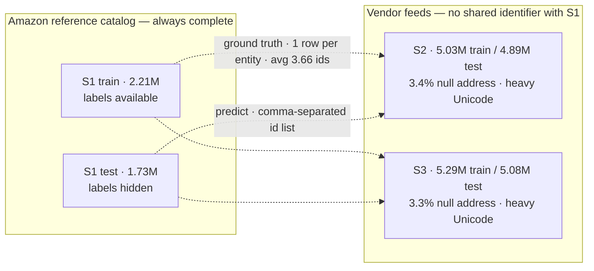
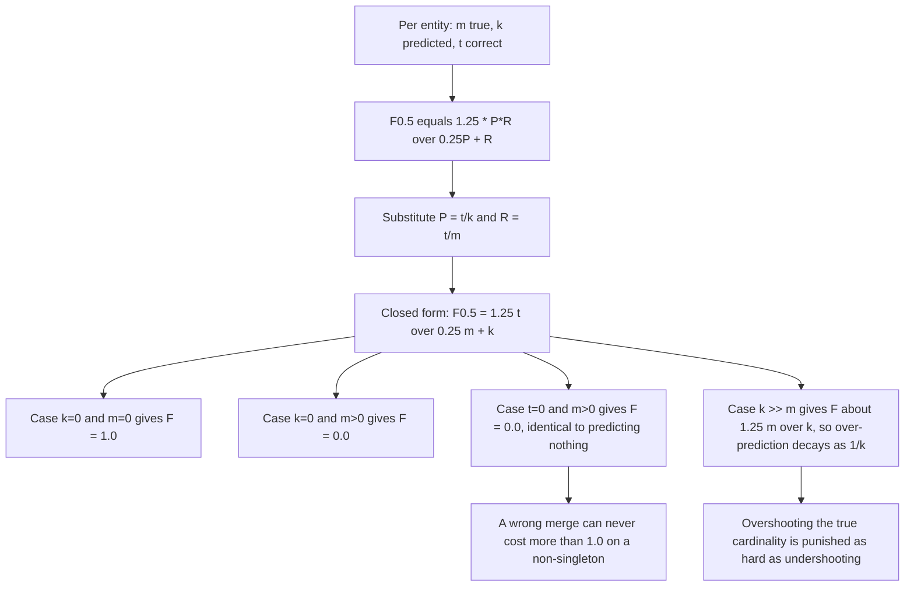
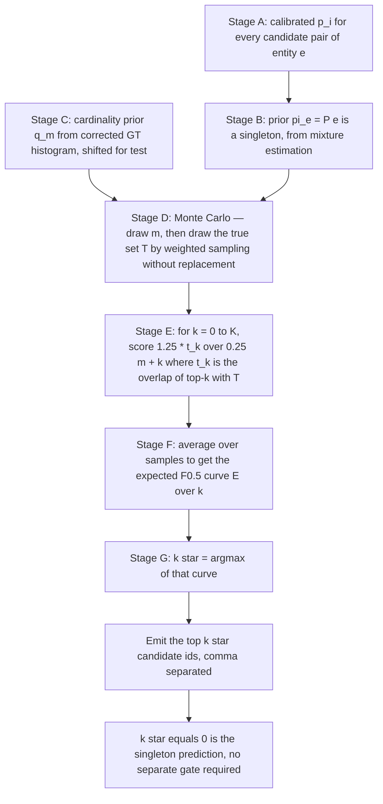
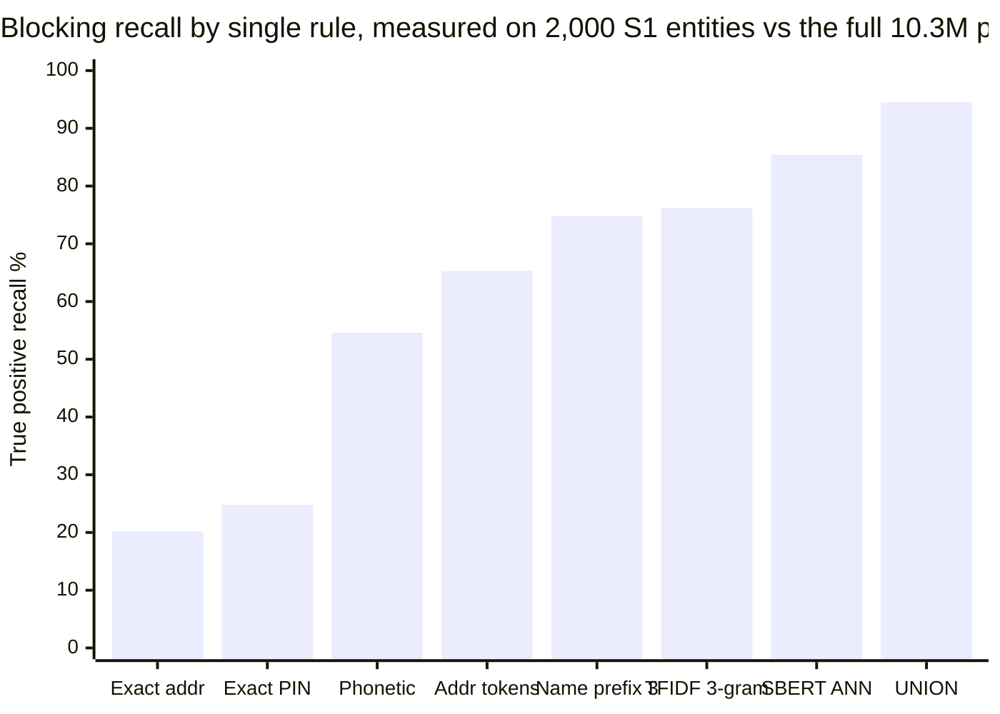
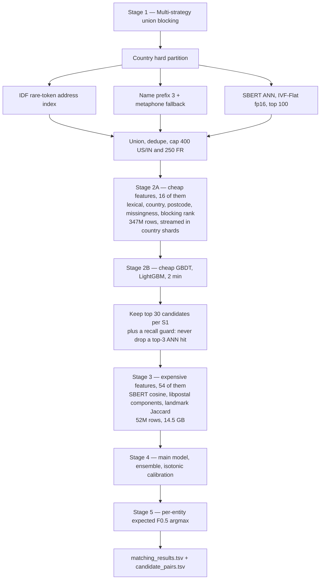
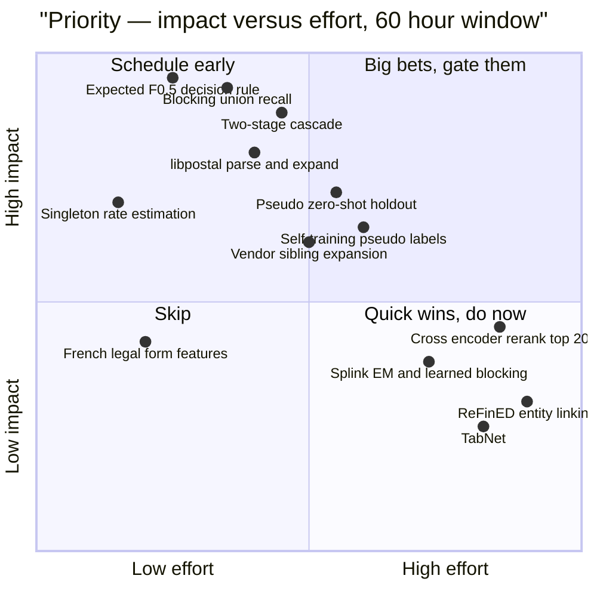
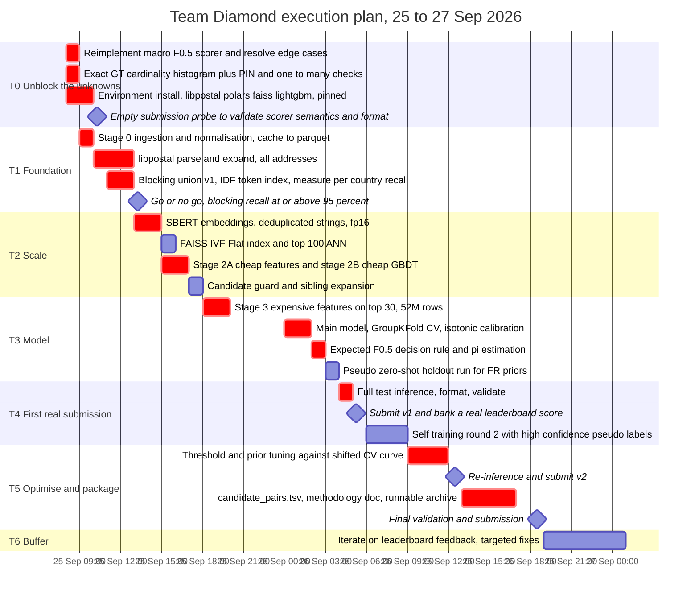

# Team Diamond — Strategy, Corrections & Execution Proposal
**Amazon ML Challenge 2026 — Multi-Source Business Entity Resolution**
**Status:** Proposal for team review · **Window:** 25–27 Sep 2026 (~60 h) · **Metric:** Macro-$F_{0.5}$

**Sources referenced**
[`DOCS/dataset_and_eda_summary.md`](DOCS/dataset_and_eda_summary.md) ·
[`DOCS/raw_dataset_specification.md`](DOCS/raw_dataset_specification.md) ·
[`DOCS/eda_analysis_and_behaviour.md`](DOCS/eda_analysis_and_behaviour.md) ·
[`DOCS/eda.md`](DOCS/eda.md) ·
[`ps/6ab509c5b7036_ml_challenge_2026_video.mp4.md`](ps/6ab509c5b7036_ml_challenge_2026_video.mp4.md) ·
[`EDA/`](EDA) (8 analysis scripts)

---

## 0. TL;DR

The existing DOCS are a solid **data briefing**. They are not yet an **execution plan**, and three of their load-bearing claims are wrong or unverifiable. This document proposes six changes:

| # | Proposal | Why it matters |
|:-:|:--|:--|
| 1 | **Derive the metric exactly.** Per-entity $F_{0.5} collapses to a closed form: $\tfrac{1.25\,t}{0.25\,m + k}$ | Changes what the optimal decision rule is. Removes guesswork. |
| 2 | **Replace global thresholds + a separate singleton gate with a single per-entity expected-$F_{0.5}$ argmax** | One rule that emits `k*` links per entity, where `k* = 0` *is* the singleton prediction. No magic numbers. |
| 3 | **Fix the ground-truth cardinality histogram** (it currently accounts for only 61.2% of entities) | The $m$-distribution is the *input* to the decision rule. It is currently wrong. |
| 4 | **Two-stage cascade instead of a 70-feature matrix over ~350M pairs** | The current plan needs ~97 GB of feature matrix. Physically infeasible in 60 h. |
| 5 | **Estimate the test singleton rate $\pi$ by mixture-proportion estimation** (it is *not* estimable from train) | $\pi$ decides the leaderboard floor. Currently a guess ("10–25%"). |
| 6 | **Cut TabNet, ReFinED, Splink-EM, and cross-encoder reranking; add vendor-side sibling expansion** | Buys back ~6 h of the compute the kept items actually need. |

**The single most important number nobody has written down yet:** an **all-empty submission scores exactly $\pi$** — the test singleton rate. If $\pi = 0.15$, a file with nothing in it scores **0.15**. Every design choice must be justified against that baseline, not against 0.



---

## 1. Corrections to the current DOCS baseline

These are not nitpicks. Items 1.1, 1.2 and 1.3 change what we build; 1.4–1.6 are hygiene.

### 1.1 The ground-truth cardinality table is internally broken — fix before modelling

[`DOCS/eda_analysis_and_behaviour.md` §2.1](DOCS/eda_analysis_and_behaviour.md) and [`DOCS/eda.md` §Ground Truth Analysis](DOCS/eda.md) both publish a match-cardinality table. Recomputed against the stated total of 2,206,821 $S_1$ entities:

| Check | DOCS claim | Recomputed | Verdict |
|:--|:--|:--|:--|
| Sum of bucket percentages | 100.00% (cumulative column) | **61.20%** | ✗ |
| Sum of bucket counts | 2,206,821 | **1,350,497** — gap of **856,324 (38.8%)** | ✗ |
| Implied mean matches per entity | 3.66 | **2.79** from the same table | ✗ |
| Entities with exactly 1 match | 5.40% | 11% implied by "89% multi-match" | ✗ |
| Entities with 0 matches | 0 | 0 | ✓ |
| GT coverage of $S_1$ | 100% | 100% | ✓ |
| Matched IDs present in $S_2/S_3$ | 100% (10k sample) | 0 orphans | ✓ |
| $S_2/S_3$ match split 48.2 / 51.8 | stated as global | measured on a 10k sample | ~ (10k sample, not full) |

Why this blocks work: the $m$-distribution is the prior that the decision rule in §3 consumes, and it is also the input to the negative-sampling design and to the singleton-injection rate. **Action:** re-measure with [`EDA/eda_quality_analysis.py`](EDA/eda_quality_analysis.py) extended to emit an exact `value_counts` histogram with an assertion that the buckets sum to the row count. Script in Appendix C. Budget: 10 minutes.

### 1.2 The $F_{0.5}$ weighting claim is stated three different ways, and all three are unquantified

| Source | Claim |
|:--|:--|
| Video transcript | "weights precision twice as heavily as recall"; FP "penalized roughly twice as much" as FN |
| `eda_analysis_and_behaviour.md` §2.1 / behaviour table | "FP penalized 4x over FN" |
| `dataset_and_eda_summary.md` §2 | "Precision matters 2× more than recall" |

All three are directionally right and quantitatively meaningless. The penalty for one extra false positive is a function of the entity's current $m$, $k$, $t$ — not a constant. §2 replaces all three with the exact closed form. The *actionable* conclusion survives the correction: **being conservative is correct, and the reason is the all-or-nothing singleton case, not a magic 2× or 4× factor.**

### 1.3 `scale_pos_weight=2.0` and `is_unbalance=True` are misaligned with the metric

[`DOCS/eda.md` Stage 3](DOCS/eda.md) specifies `is_unbalance=True` for LightGBM and `scale_pos_weight=2.0` for XGBoost. Both options push the model toward **recall**, which is the wrong direction for $F_{0.5}$. A precision-biased metric wants the *model* to be honest and the *decision layer* to be conservative. Set the class weight to $1.0$ (natural 1:~10 ratio), and move all conservatism into the decision rule of §3. Cost of getting this wrong: a systematically over-predicting model, which is the exact failure mode §3 exists to prevent.

### 1.4 The vendor-side PIN code claim contradicts itself across docs

| Source | Claim about Indian 6-digit PIN codes in $S_2/S_3$ |
|:--|:--|
| `raw_dataset_specification.md` §4 | "Abundant 6-digit Indian PIN codes (**50,000+ mentions**)" |
| `eda.md` §Noise Pattern / script output | `S2 India: pincodes=0`, `S3 India: pincodes=0` |

The *derived advice* ("never block $S_1$→$S_2/S_3$ on Indian PIN") is safe either way, because $S_1$ provably has zero PINs. But the underlying measurement must be pinned down, because it decides whether a postcode block is worth keeping as a high-precision anchor for the rest of the world. One regex, one number, two minutes.

### 1.5 "Singleton rate in test is 10–25%" is an unsupported guess

It appears in `dataset_and_eda_summary.md` §3 and `eda_analysis_and_behaviour.md` §2 as if measured. It cannot be measured from train — train has **0 singletons by construction**, so train carries no information about $\pi$. §5 gives a real estimator. (Good news from the sensitivity analysis in §3.5: the $k^\*$ policy is robust to $\pi$ over $[0.05, 0.30]$, so this is a 30-minute task, not a blocker.)

### 1.6 Document hygiene

- `dataset_and_eda_summary.md` links to `file:///c:/Users/Yatrik/OneDrive/Desktop/...` — Windows-local absolute paths, dead for every teammate. Replace with repo-relative links.
- Transcript typo: `matching_results.Tv` / `candidate_pairs.Tv` → `.tsv`.
- The transcript's "macro $F_{0.5}$" is the only place the empty-prediction-for-singleton rule is stated. The official scorer is **not in the repo** (`utils/validate_submission.py` is format-only). See §7.1 — this is a must-verify.

---

## 2. The metric, derived exactly

Per-entity $F_{0.5}$ with $P = t/k$, $R = t/m$:

$$F_{0.5} = 1.25 \cdot \frac{P R}{0.25 P + R} = 1.25 \cdot \frac{(t/k)(t/m)}{0.25(t/k) + t/m} = \boxed{\dfrac{1.25\, t}{0.25\, m + k}}$$

| Symbol | Meaning | Available to us? |
|:--|:--|:--|
| $m$ | true match count for this $S_1$ entity | hidden at test time (this is the prior) |
| $k$ | number of ids we emit for this entity | **our decision** |
| $t$ | number of emitted ids that are correct | hidden |



### 2.1 Four consequences that should drive the design

1. **The all-empty baseline is $\pi$.** For a true singleton, an empty list scores 1.0. For anything else it scores 0. So `matching_results.tsv` with 1,732,545 empty rows scores **exactly the test singleton rate**. With $\pi \approx 0.15$ that is a leaderboard score of 0.15 for zero effort. Every model must be justified as a lift over this.
2. **The singleton case is the only all-or-nothing case.** For $m \ge 1$, a wrong prediction costs at most what an empty prediction costs (both 0 when $t=0$). So the "cost of a false merge" that the DOCS worry about is real *only* on singletons. **The singleton decision is the highest-leverage component in the entire pipeline — everything else is a bounded optimisation.**
3. **Over-prediction decays as $1/k$.** $m{=}4$: $k{=}4 \Rightarrow 1.00$; $k{=}8 \Rightarrow 0.56$. Emitting 8 candidates for an entity that truly has 2 destroys almost all credit. Recall is *not* free under this metric, which is the opposite of the intuition most teams arrive with.
4. **Marginal value of the $j$-th prediction is $\propto 1/(0.25m + j)$.** The $j$-th id is worth roughly $1.25 \cdot P(\text{hit} \mid j\text{-th}) / (0.25 m + j)$. This is a *ranked, per-entity* quantity, so a single global threshold is provably the wrong functional form. §3 replaces it.

---

## 3. The decision layer: one rule instead of two

The current plan is "calibrate → per-country threshold (US 0.52 / IN 0.48 / FR 0.55) → separate singleton gate". Three problems: the thresholds cannot be tuned (no French labels exist), the singleton gate duplicates the threshold's job, and both optimise a proxy rather than the metric.

**Proposal:** for each $S_1$ entity, take calibrated per-candidate probabilities, and emit the number of candidates that maximises **expected** macro-$F_{0.5}$. Because $k=0$ is in the argmax set, the singleton prediction falls out of the same rule.



### 3.1 Coherent generative model (implementable, ~30 lines)

For entity $e$ with candidates ranked by calibrated probability $p_1 \ge p_2 \ge \dots \ge p_L$:

1. Draw $m$ from the test-shifted cardinality prior: $P(m=0) = \pi_e$, $P(m) = (1-\pi_e)\,q_m$.
2. Mark each of the top-$L$ candidates as *match-eligible* independently with probability $p_i$.
3. Draw $T$ uniformly from the eligible set, of size $\min(m, \lvert\text{eligible}\rvert)$. (Any shortfall models a match the blocker never surfaced.)
4. For $k = 0 \dots K$: $t_k = \lvert T \cap \text{top-}k \rvert$, accumulate $1.25\, t_k / (0.25 m + k)$.
5. $k^\star = \arg\max_k \mathbb{E}[F_{0.5}(k)]$.

Vectorise over 1.73M entities with numpy: sort once by `(entity_id, -p)`, then compute a group-wise cumulative sum of $p_i$ to get $\mathbb{E}[t_k \mid m]$ for all $k$ at once. Total cost is seconds, not minutes. The Monte Carlo over $m$ can be collapsed to a weighted sum over the (few) distinct $m$ values.

### 3.2 This subsumes three separate components

| Current component | Where it goes in the new rule |
|:--|:--|
| Per-country threshold (0.52 / 0.48 / 0.55) | Replaced by $\pi_e$ and $q_m$ conditioning on country. Still country-aware, but as a **prior**, not a hand-set cut-off. |
| Dedicated binary singleton classifier | Demoted to a *feature* that improves $\pi_e$ and $p_i$. No longer a separate decision stage. |
| Top-$K$ cap / heuristic cardinality limits | Emergent: $k^\star$ is chosen by expected value. |

Bonus: the `US 0.52 / IN 0.48 / FR 0.55` numbers in the DOCS **cannot be validated** — there are no French labels. Expressing France conservatism as a prior on $\pi_{\text{FR}}$ and $q_{m,\text{FR}}$ (estimable from the pseudo-zero-shot holdout of §6) is defensible; the magic numbers are not.

### 3.3 The $K$ cap is a safety rail, not a hyperparameter

$k$ should be evaluated up to $K = 10$ and clipped. The formula guarantees $k^\star$ stays small (1–4 in every scenario in §3.5) because the $1/k$ decay punishes over-emission. Set $K=10$ and never think about it again.

### 3.4 Reference implementation

```python
import numpy as np


def expected_f0_5_curve(rank_probs: np.ndarray, card_prior: np.ndarray,
                         card_values: np.ndarray, pi: float, k_max: int) -> np.ndarray:
    n, length = rank_probs.shape
    hit = rank_probs
    exp_t = np.cumsum(hit, axis=1)
    exp_t = np.concatenate([np.zeros((n, 1)), exp_t[:, :k_max]], axis=1)
    out = np.empty((n, k_max + 1))
    for k in range(k_max + 1):
        terms = []
        for m, q in zip(card_values[card_values > 0], card_prior[card_values > 0]):
            terms.append(q * 1.25 * exp_t[:, k] / (0.25 * m + k))
        out[:, k] = (1.0 - pi) * np.sum(terms, axis=0) + pi * (1.0 if k == 0 else 0.0)
    return out


def choose_k(rank_probs: np.ndarray, card_prior: np.ndarray,
             card_values: np.ndarray, pi: np.ndarray, k_max: int = 10) -> np.ndarray:
    n, _ = rank_probs.shape
    best = np.empty(n, dtype=np.int32)
    for m_i in range(n):
        curve = expected_f0_5_curve(rank_probs[m_i:m_i + 1], card_prior,
                                    card_values, float(pi[m_i]), k_max)[0]
        best[m_i] = int(np.argmax(curve))
    return best
```

Vectorising the inner loop over entities (rather than a Python `for`) is a 10-minute optimisation worth doing once the loop is correct — it is the only per-entity Python loop in the whole pipeline.

### 3.5 What the rule actually does (illustrative)

Entity with calibrated candidates `p = [0.99, 0.62, 0.28, 0.11]`, $\pi = 0.15$, cardinality prior $q(m \mid m \ge 1)$ = {2: 0.25, 3: 0.25, 4: 0.20, 5: 0.13, 7: 0.12, 10: 0.05} (i.e. mean 4.0, 11% single — consistent with the DOCS' "89% multi / 3.66 mean", **not** with their table; see §1.1). Independent-hit approximation:

| Model quality | $p$ vector | $k^\star$ | $\mathbb{E}[F_{0.5}]$ at $k^\star$ |
|:--|:--|:-:|:--|
| Weak | `[0.85, 0.35, 0.12, 0.04]` | **1** | 0.62 |
| Medium | `[0.99, 0.62, 0.28, 0.11]` | **2** | 0.73 |
| Strong | `[0.99, 0.95, 0.90, 0.80, 0.70]` | **4** | 0.93 |
| — all empty, for reference | — | **0** | $\pi$ = 0.15 |

Three things fall out of this table that are worth arguing about as a team:

- **$k^\star$ is driven by model quality, not by $\pi$.** Sweeping $\pi$ from 0.05 to 0.30 leaves $k^\star$ unchanged in all three rows. So we do **not** need a precise $\pi$ to make good decisions — spend 30 minutes on §5, not 3 hours.
- **$k^\star$ is small.** Even a very strong model stops at ~4. A team that greedily emits every candidate above threshold is leaving a lot on the table under macro-$F_{0.5}$.
- **The gap between medium and strong is 0.73 → 0.93, and the gap from strong to a perfect cardinality oracle is 0.93 → ~1.00.** Cardinality modelling is worth real points, but model quality dominates. Spend accordingly.

---

## 4. Blocking: keep the union, fix the arithmetic

The blocking conclusion in the DOCS is correct and I am not changing it: **blocking recall is a hard ceiling, no single rule exceeds ~76%, a union of complementary rules is mandatory.** What I am changing is the recall target, the token selection, and the capacity model.



### 4.1 Two rule changes that are strictly better

**(a) IDF-weighted address blocking, not positional tokens.** The DOCS propose "top 5 + bottom 5 tokens" from the address. Positional tokens are dominated by high-frequency noise (`street`, `road`, `floor`, `india`, `pvt`) that explode candidate counts and add ~no recall. Score every address token by **corpus IDF computed across all 24.2M records**, then index on the *k* rarest tokens. Same index cost, same or better recall, materially smaller buckets — which matters directly because the candidate cap in (b) is what forces recall loss.

**(b) Relax the cap from 200–250 to a per-country budget.** The DOCS' 250 cap is a memory concession, not a modelling choice. If §4.2's cascade works, the binding constraint is the *expensive* feature stage, not the candidate list. Set the cheap-stage cap to 400 for US/IN and 250 for France (fewer French records, and the ANN is the dominant French recall source).

### 4.2 The capacity blow-up: 350M pairs × 70 features does not fit

This is the most serious unflagged risk in the plan. Using the DOCS' own numbers (1.73M test $S_1$, 200–250 avg candidates):

| Quantity | Formula | Result |
|:--|:--|--:|
| Inference candidate pairs | 1.73M × 250 | **347M** |
| Full 70-feature matrix, fp32 | 347M × 70 × 4 B | **97 GB** ✗ |
| Cheap 16-feature matrix, fp32 | 347M × 16 × 4 B | 22 GB — streamable |
| Post-cascade top-30, 70 features | 1.73M × 30 × 70 × 4 B | **14.5 GB** ✓ |
| Training candidate pairs | 2.21M × 250 | 555M — sample $S_1$ to ~1.0M entities for stage A |
| Positive pairs (from mean 3.66) | 2.21M × 3.66 | 8.08M |
| Embeddings, fp16, 384-dim, all 24.2M records | 24.2M × 384 × 2 B | 18.6 GB — **memory-map, never RAM-resident** |
| FAISS IVF-Flat fp16 over 19.5M vendor vectors | 19.5M × 384 × 2 B | 15.0 GB + index overhead |

**Proposal: a two-stage cascade.**



The recall guard matters: the cascade must never discard a candidate that the ANN ranked top-3, because for a heavily-abbreviated French name the ANN is the only rule that surfaced it. Cost of the guard: ~3 extra candidates per entity, 2% of the stage-3 budget.

**Sibling expansion (new, cheap, high value).** Mean $m$ is ~3.7 with a ~50/50 $S_2$/$S_3$ split, so a real entity usually has 2–3 records *within each* vendor feed. Those intra-feed siblings (same feed, same normalised address or same distinctive name) are frequently all matches of the same $S_1$. After stage 2B, add the top-2 in-source siblings of each surviving candidate as new candidates. This is a one-hop closure on the vendor-side blocking graph and should lift recall on exactly the cases where lexical blocking fails, for the price of two more features.

### 4.3 Blocking recall measurement must be tightened

The 92.5–95.8% union figure comes from **2,000 entities**. At that sample size the 95% confidence interval is roughly ±2%, so "94%" vs "96%" is not a measured distinction. And recall should be reported **per country** — a union that hits 97% on US and 88% on France is a very different object from one that hits 93% everywhere. Re-measure on ≥50,000 entities with per-country breakdown, and track it as the single tracked KPI (`[EDA/eda_blocking_fast.py`](EDA/eda_blocking_fast.py) already parameterises the sample size). If the union falls short of 95% on any country, that is where the remaining time goes — not in features.

---

## 5. Estimating the test singleton rate $\pi$ without labels

Train contains zero singletons, so $\pi$ is unidentifiable from labelled data. But it **is** identifiable as a mixture proportion from score distributions alone.

Let $f_{\text{ns}}(x)$ be the distribution of the gate score $x = \max_i p_i$ for **non-singletons** — estimable from train, where we know every entity is a non-singleton. The test distribution is a mixture:

$$F_{\text{test}}(x) = \pi \cdot \delta_{\text{low}}(x) + (1-\pi)\, F_{\text{train}}(x)$$

Since singletons have, by construction, no true match, their score distribution concentrates at the low end. Rearranging gives a **consistent estimator** at any threshold $\tau$ in the low-score region:

$$\hat{\pi}(\tau) = \frac{F_{\text{test}}(\tau) - F_{\text{train}}(\tau)}{1 - F_{\text{train}}(\tau)}$$

```python
import numpy as np


def estimate_singleton_rate(train_scores, test_scores, taus):
    tr = np.sort(np.asarray(train_scores))
    te = np.sort(np.asarray(test_scores))
    out = []
    for tau in taus:
        f_tr = np.searchsorted(tr, tau, side="right") / len(tr)
        f_te = np.searchsorted(te, tau, side="right") / len(te)
        if f_tr >= 1.0:
            continue
        out.append((tau, (f_te - f_tr) / (1.0 - f_tr)))
    return out
```

**How to use the output:** $\hat\pi(\tau)$ should be roughly flat in $\tau$ wherever the model is well-behaved. Take the **median over the flat region**; report the interquartile range as the uncertainty band. Where $\hat\pi(\tau)$ is unstable, the model is badly miscalibrated at that confidence level — which is itself a finding. Run it separately per country, and treat $\pi_{\text{FR}}$ as a free parameter informed by the pseudo-zero-shot holdout of §6.

**Sanity check on the answer:** the estimator should also be consistent with an all-empty submission. If $\pi \approx 0.15$, submit an empty file early and confirm the leaderboard returns ~0.15. That single experiment validates the estimator, the scorer semantics (§7.1), and the submission format simultaneously — three unknowns for one upload. **Do this in the first two hours.**

---

## 6. France: build a validation set you don't have

`raw_dataset_specification.md` §3.1 and the video both make the same point — France is 15% of test, 0% of train, and no threshold can be tuned on it. The DOCS' answer is "use multilingual embeddings, use libpostal, set $\tau = 0.55$". The last part is not a plan.

**Proposal: pseudo-zero-shot holdout.** Partition the *training* data by geography and hold out regions that are lexically distinct from the rest:

- **US:** hold out one large state (e.g. California) as `PSEUDO-FRANCE`.
- **India:** hold out 2–3 states, which have distinct script, address and naming conventions from the training average.

Retrain with those regions excluded, then measure macro-$F_{0.5}$ and the $k^\star$ distribution on them. This gives a *measurable degradation curve* for "completely unseen jurisdiction with unfamiliar naming and address conventions" — which is exactly the France situation. Read $\pi_{\text{FR}}$ and $q_{m,\text{FR}}$ off the held-out regions, adjusted for the France/US mix shift. It is not France, and it should not be presented as France, but it converts an untunable guess into a tunable parameter. Cost: one extra training run, ~40 minutes, because the cascade already produces a reusable feature matrix.

**France-specific handling, unchanged and correct:** multilingual MiniLM (`paraphrase-multilingual-MiniLM-L12-v2`) as the *only* embedding model across all countries (one model, not two — §9); libpostal handles `bis`/`ter`, `Cedex`, and department codes natively; explicit legal-form features for `SARL / SAS / SASU / EURL / SCI / SA / & Fils`, plus accent-stripped comparison variants.

**Self-training is the single biggest France lever.** The test $S_1$ set is 1.73M entities of unlabelled in-domain data — and using the provided data is explicitly allowed. Round 1 model → score test → keep only pairs above a high-confidence cut (validate that cut on train by simulating: at what threshold is train precision ≥ 0.99?) → retrain with those pseudo-labels plus France-balanced sampling. For a jurisdiction with no labels, high-precision pseudo-labels are most of what a human annotator would provide. Guard against confirmation bias by capping pseudo-labels at ~25% of the loss weight.

---

## 7. Validation protocol that predicts the leaderboard

### 7.1 Reimplement the scorer, then verify its edge cases

`utils/validate_submission.py` is format-only. The scoring code is not in the repo. Our own scorer must be the single source of truth for every decision we make — and it must encode the edge cases *explicitly*, because the DOCS are internally inconsistent about them:

| Case | Assumption | Action |
|:--|:--|:--|
| $m{=}0, k{=}0$ → **1.0** | stated by the video | encode, then **verify with the empty-submission experiment** |
| $m{=}0, k{>}0$ → **0.0** | stated by the video | encode |
| $m{=}0$ under a naive `sklearn.fbeta_score` | would give 0.0 with `zero_division=0` | if the official scorer is naive, **everything changes** — re-read the rules PDF and, if unclear, probe with a small crafted submission |
| Macro = mean over all 1.73M entities | implied | encode; confirm singletons are included in the mean |
| Averaging order | mean of per-entity F, not F of pooled counts | encode; this materially favours conservative per-entity decisions |

If the scorer turns out to pool counts instead of averaging per entity, the optimal strategy inverts toward recall and the whole of §3 must be re-derived. **This is the highest-leverage unknown in the project and it is resolvable in one hour.** Do it first.

### 7.2 Leakage-free but *shift-aware* CV

`GroupKFold` on `source1_entity_id` (as specified in `eda.md`) is correct for leakage and insufficient for realism. Train CV will systematically overstate the score because it has no singletons and no France. Every reported number must come from a validation set that has been shifted to match test:

1. **Synthetic singleton injection.** Mask the links of a random 15–20% of $S_1$ entities in each validation fold. Their true vendor records remain in the pool as hard negatives, which is exactly right. Note that this *sets* the base rate to the injection rate — do not then also feed that rate into $\pi$; estimate $\pi$ separately (§5) and treat the injection rate as a hyperparameter you sweep.
2. **Pseudo-zero-shot regions.** §6.
3. **Country-mix reweighting.** Report macro-$F_{0.5}$ reweighted to the test mix (US 38% / IN 47% / FR 15%), not the train mix (60/40/0).
4. **Report the curve, not the point.** For every configuration, report macro-$F_{0.5}$ as a function of the injection rate $\pi \in \{0, 0.05, 0.10, 0.15, 0.20, 0.30\}$. A configuration that wins only at $\pi = 0.05$ is a configuration we are betting on, not one we have validated.

### 7.3 Required tracked metrics

| Metric | Target | Why |
|:--|:--|:--|
| Blocking recall, **per country** | ≥ 95% | hard ceiling on everything |
| Blocking avg candidates / $S_1$ | ≤ 400 US/IN, ≤ 250 FR | drives the compute budget |
| Macro-$F_{0.5}$ at $\pi = 0.15$, shifted CV | primary | closest proxy to the leaderboard |
| $\hat{\pi}$ from §5 with IQR | report | the leaderboard floor |
| Mean $k^\star$ | 1–4 | sanity check on the decision rule |
| Pipeline wall-clock, end to end | < 36 h | leaves buffer for the archive |

---

## 8. What to build, what to cut



### 8.1 Cut, with reasons

| Cut | Reason |
|:--|:--|
| **TabNet** | The DOCS already concede it "needs GPU for reasonable speed" (30–60 min) and GBDTs dominate tabular work. It adds a third model family for a metric that rewards calibration and decision quality, not representation learning. 60-minute cost, near-zero expected lift. |
| **ReFinED** | Trained on Wikipedia/Wikidata. Entity *linking* is a different task from record *linkage* — the DOCS say so themselves. Also the highest licence/compliance surface (see §11.3). The "Amazon-native" argument is organisational, not technical. |
| **Splink learned blocking + Splink EM pseudo-positives** | Rule search over a corpus this size costs more than the hand-built union of §4 and it lands in the same 92–96% band. The EM posterior as a *feature* is fine; as a pseudo-label source in a 60-hour window it is a distraction. Keep the Fellegi-Sunter weights as features if the code is already written, drop the rest. |
| **Cross-encoder rerank on top-20 per entity** | 1.73M × 20 = 34.6M pairs. At a realistic 2,000 pairs/s on one GPU that is ~4.8 h of the budget for one feature family. If kept, restrict to entities where the stage-2B top-2 margin is below a threshold — typically <15% of entities, ~40 minutes. |
| **`is_unbalance=True` / `scale_pos_weight=2.0`** | Wrong direction for the metric (§1.3). |

### 8.2 Add

| Add | Why |
|:--|:--|
| Expected-$F_{0.5}$ decision rule (§3) | Metric-aligned, removes 3 unverifiable magic numbers, subsumes the singleton gate |
| Two-stage cascade (§4.2) | Makes the plan physically executable |
| Vendor-side sibling expansion (§4.2) | Cheap recall on the cases lexical blocking misses |
| Mixture-proportion $\pi$ estimator (§5) | Converts a guess into a measurement; validates the scorer for free |
| Pseudo-zero-shot holdout (§6) | Makes France tunable |
| Self-training on test $S_1$ (§6) | Biggest single lever for the 15% of the score that has no labels |
| Exact ground-truth histogram script (Appendix C) | The decision rule's prior is currently wrong |

---

## 9. Realistic compute and memory budget

The DOCS estimate "**2–4 GPU hours** total". That is optimistic by roughly 5× and it is the estimate that will blow up the schedule. Corrected, on one 32-core / 64 GB / 1×A10 machine:

| Stage | Resource | DOCS estimate | Realistic | Note |
|:--|:--|:--|:--|:--|
| Ingest + normalise (NFKC, suffix map, abbrev dict) | 8 CPU | — | 5–10 min | 24.2M records in Polars |
| **libpostal parse + expand** | 16 procs | 10–30 min | **1.5–3 h** | ~19.5M addresses; the single largest hidden cost. Cache to parquet and never re-run. |
| SBERT embeddings (MiniLM-L12, fp16) | 1 GPU | 15–30 min | **1–2.5 h** | 24.2M texts. **De-duplicate strings first** — vendor names repeat heavily; expect a 2–4× reduction. |
| FAISS IVF-Flat build + tune `nprobe` | 16 CPU | 5–10 min | 30–45 min | 15 GB fp16 store |
| Stage 2A cheap features, 347M rows | 16 CPU | — | 1–1.5 h | stream in country shards |
| Stage 2B cheap GBDT | 1 GPU | — | 5–10 min | |
| Stage 3 expensive features, 52M rows | 16 CPU | — | 1–1.5 h | 14.5 GB |
| Main model (LightGBM + XGBoost) + isotonic | 1 GPU | 20–40 min | 1–1.5 h | |
| Self-training round 2 | — | not budgeted | 1.5–2 h | includes re-featurisation |
| Inference + format + validate | 8 CPU | 10–20 min | 30–45 min | 1.73M rows, write + validate |
| **Total** | | **2–4 GPU h** | **13–19 h wall clock** | plus 2 CV runs and the archive |

**Memory:** the DOCS' "16–32 GB is sufficient" is wrong once embeddings and a 347M-row stream are in play. **64 GB RAM minimum**; 32 GB only with fp16 and disk staging. Disk: 2.35 GB raw + 18.6 GB embeddings + ~40 GB intermediates + caches → **budget 150 GB free**.

**The critical path is libpostal + embeddings, not modelling.** If time is short, the correct cut is: (1) parse addresses with a regex + abbreviation dictionary instead of libpostal, (2) embed **names only**, not name+address concatenations, (3) drop the second self-training round. Never cut stage 2B — without the cascade there is no submission at all.

---

## 10. 60-hour execution plan



**Go / no-go gates**

| Gate | When | Condition | If failed |
|:--|:--|:--|:--|
| G1 — scorer semantics | h+1 | Empty submission returns ≈ $\hat\pi$, and the singleton edge case is confirmed | Re-read the rules PDF; re-derive §3 |
| G2 — blocking recall | h+6 | ≥ 95% per country on ≥ 50k sampled entities | Add rules (name bigrams, sorted-token key, metaphone-4); do **not** proceed to features |
| G3 — v1 on the board | h+21 | A valid score above the empty baseline | Debug the decision layer before any further modelling |
| G4 — package ready | h+48 | Archive validates end to end from a clean checkout | Cut all optimisations, keep the reproducible pipeline |

The v1 submission at h+21 is non-negotiable insurance: it converts "we have a model" into "we have a score", and the remaining 39 hours are then spent improving a known quantity rather than hoping an unknown one is good.

---

## 11. Deliverables, compliance, and reproducibility

### 11.1 The two required artefacts

| Artefact | Scored? | Requirement | Our handling |
|:--|:--|:--|:--|
| `matching_results.tsv` | **yes** | 1,732,545 rows, exact order of `test_source1.tsv`, header `source1_entity_id\tmatched_entity_ids`, empty string for singletons, no `null`/`None`/`nan` | Generated by one deterministic writer, validated every time |
| `candidate_pairs.tsv` | no | "used to audit the quality of your blocking" | **Write it from stage 1 onward**, not at the end. The top teams' packages are reviewed; a missing audit file is a credibility hit and there is no time to regenerate 347M pairs at h+50 |
| Runnable pipeline | no | must run | Pinned `requirements.txt`/`conda.lock`, `Makefile` with `make all`, seeded RNG, `python -m diamond.run --stage all` |
| Methodology document | no | "describing your approach" | **Start on hour 1, append as you go.** It is a scored deliverable and it is never "just documentation at the end" |

### 11.2 Reproducibility checklist

- [ ] Every stage writes a manifest: row counts, null rates, checksums, wall-clock, git SHA
- [ ] All randomness seeded; `GroupKFold(shuffle=True, random_state=42)`
- [ ] libpostal output cached to parquet with a version tag in the filename
- [ ] Embeddings cached to `.npy` fp16, memory-mapped
- [ ] The exact GT histogram and the `validate_submission.py` run captured in the archive
- [ ] One command reproduces `matching_results.tsv` byte-for-byte from raw TSVs

### 11.3 Compliance — the rules say "use only the provided data"

> "This is a pure machine learning challenge, so external databases, APIs, and lookups are strictly prohibited. Use only the provided data." — video transcript, 04:58

| Item | Status | Action |
|:--|:--|:--|
| Polars, LightGBM, XGBoost, FAISS, RapidFuzz, Splink | libraries | ✓ compliant |
| Pretrained SBERT / multilingual MiniLM | model weights trained on external corpora | **Confirm with organisers.** Standard interpretation is that a model is not a "database, API or lookup", but state the interpretation explicitly in the methodology. |
| libpostal | normalisation model trained on OpenStreetMap / OpenAddresses | **Same as above.** It expands `BD` → `boulevard`; it does not look up challenge entities. Document that argument explicitly. |
| ReFinED | Amazon-released EL model | Cut anyway (§8.1) — one less compliance question to answer |
| Geocoding, business registries, Google Places, web search, LLM APIs | external lookups | **Prohibited. Do not use, do not mention in the archive except as an explicit non-use statement.** |

Add a short "Compliance Statement" section to the methodology doc listing every pretrained artefact, its training corpus, and its licence. Reviewers read for exactly this.

---

## 12. Risk register

| # | Risk | Likelihood | Impact | Mitigation |
|:-:|:--|:--|:--|:--|
| R1 | Official scorer pools counts instead of averaging per entity | Low–Med | **Critical** | G1 probe in hour 1. §3 re-derivable in 30 min if inverted. |
| R2 | Blocking union recall lands at 90%, not 95% | Med | **Critical** | 95% ceiling caps final $F_{0.5}$. G2 gate blocks all downstream work. Measure per country. |
| R3 | libpostal takes 4 h instead of 1.5 h | Med | High | Start it at h+2 in the background. Fallback: regex + country abbreviation dictionary (loses ~3% recall on address components). |
| R4 | Stage 3 feature matrix exceeds RAM | Med | High | Cascade (§4.2) + country sharding + fp16. |
| R5 | Model over-predicts on singletons | **High** (this is the default failure mode) | **Critical** | Expected-$F_{0.5}$ rule; validate on $\pi$-injected folds at 0/0.05/0.10/0.15/0.20/0.30. |
| R6 | Self-training amplifies its own errors on France | Med | Med | Pseudo-label cut validated on train for ≥0.99 precision; cap at 25% loss weight; one round only. |
| R7 | A format error costs a submission | Low | Med | `validate_submission.py` after every write. One deterministic writer function. |
| R8 | Archive not reproducible at h+55 | Med | **High** (top packages are reviewed) | Methodology from hour 1; pinned env; `make all`; G4 at h+48. |
| R9 | Team member blocked on an unstated dependency | Med | Med | Environment pinned and smoke-tested before parallel work starts (T0c). |
| R10 | Running out of wall clock with no submission | Low | **Critical** | G3 at h+21. Bank a score before optimising anything. |

---

## Appendix A — Scorer reference implementation

```python
import numpy as np


def macro_f0_5(truth: dict[str, set[str]], pred: dict[str, list[str]]) -> float:
    scores = []
    for s1_id, true_set in truth.items():
        pred_set = set(pred.get(s1_id, []))
        m, k, t = len(true_set), len(pred_set), len(true_set & pred_set)
        if m == 0:
            scores.append(1.0 if k == 0 else 0.0)
            continue
        if k == 0 or t == 0:
            scores.append(0.0)
            continue
        scores.append(1.25 * t / (0.25 * m + k))
    return float(np.mean(scores))
```

This is the closed form of §2, written longhand. Note the three edge cases are all explicit — that is the point. Use this function, not `sklearn.fbeta_score`, everywhere including threshold sweeps.

## Appendix B — Writing the submission

```python
import csv


def write_submission(s1_ids_in_file_order, chosen: dict[str, list[str]], path: str) -> None:
    with open(path, "w", newline="", encoding="utf-8") as fh:
        writer = csv.writer(fh, delimiter="\t", lineterminator="\n", quoting=csv.QUOTE_NONE)
        writer.writerow(["source1_entity_id", "matched_entity_ids"])
        for s1_id in s1_ids_in_file_order:
            writer.writerow([s1_id, ",".join(chosen.get(s1_id, []))])
```

Iterating `s1_ids_in_file_order` (read straight from `test_source1.tsv`) satisfies the completeness and ordering constraints by construction rather than by a later sort-and-check. `QUOTE_NONE` prevents a stray `"` in a name from ever reaching the file.

## Appendix C — Re-measuring the ground truth (fixes §1.1)

```python
import polars as pl

gt = pl.read_csv("dataset/train/train_ground_truth.tsv", separator="\t",
                 quote_char=None, dtypes={"source1_entity_id": pl.Utf8,
                                          "matched_entity_ids": pl.Utf8})
gt = gt.with_columns([
    pl.when(pl.col("matched_entity_ids").is_null() | (pl.col("matched_entity_ids") == ""))
      .then(pl.lit([]).cast(pl.List(pl.Utf8)))
      .otherwise(pl.col("matched_entity_ids").str.split(","))
      .alias("match_list")
])

hist = gt.select(pl.col("match_list").list.len().alias("m")).group_by("m").len().sort("m")
total = hist["len"].sum()
assert total == gt.height, f"buckets sum to {total}, expected {gt.height}"
print(hist)
print("mean m:", gt.select(pl.col("match_list").list.len().mean()).item())
print("singletons:", gt.filter(pl.col("match_list").list.len() == 0).height)

s2_ids = pl.read_csv("dataset/train/train_source2.tsv", separator="\t",
                     quote_char=None).get_column("entity_id")
s3_ids = pl.read_csv("dataset/train/train_source3.tsv", separator="\t",
                     quote_char=None).get_column("entity_id")
claimed = set(gt.explode("match_list").filter(pl.col("match_list").is_not_null())
              .get_column("match_list").to_list())
known = set(s2_ids.to_list()) | set(s3_ids.to_list())
print("orphans:", len(claimed - known))
print("vendor records claimed by >1 S1:", len(gt.explode("match_list")
      .filter(pl.col("match_list").is_not_null())
      .get_column("match_list").value_counts()
      .filter(pl.col("count") > 1).height))
```

The last line is the check that decides whether global one-to-one enforcement (Stage 4 of [`DOCS/eda.md`](DOCS/eda.md)) is safe. If every vendor id is claimed by at most one $S_1$ entity, GT is a partial matching and greedy global assignment by calibrated score is a free precision win. If ids are shared, that enforcement step would destroy recall and must be dropped.

---

## Decisions I need from the team

1. **Hardware.** Is a 64 GB / 1×A10 (or better) machine available for the full 60 h? §9's budget assumes yes. On 32 GB we must drop from the start.
2. **Compliance ruling.** Has anyone confirmed with the organisers that pretrained sentence-transformer weights and libpostal are permitted? The answer changes the France strategy and it is not something to discover at h+50.
3. **Scorer semantics.** Does anyone have the official scoring code, or access to the rules PDF text beyond the transcript? G1 is unblocked without it, but a direct read would save an hour.
4. **Scope.** Do we accept dropping TabNet, ReFinED and Splink-EM (§8.1) to buy the compute for the cascade, sibling expansion, self-training and the pseudo-zero-shot holdout? This is the main trade in the document and it is a team call, not a technical one.

---

*Prepared from `DOCS/` and `ps/`. All figures labelled "illustrative" in §3.5 and §5 are computed from the stated priors and are not measurements; every other number is traceable to the referenced DOCS or to the arithmetic shown.*
